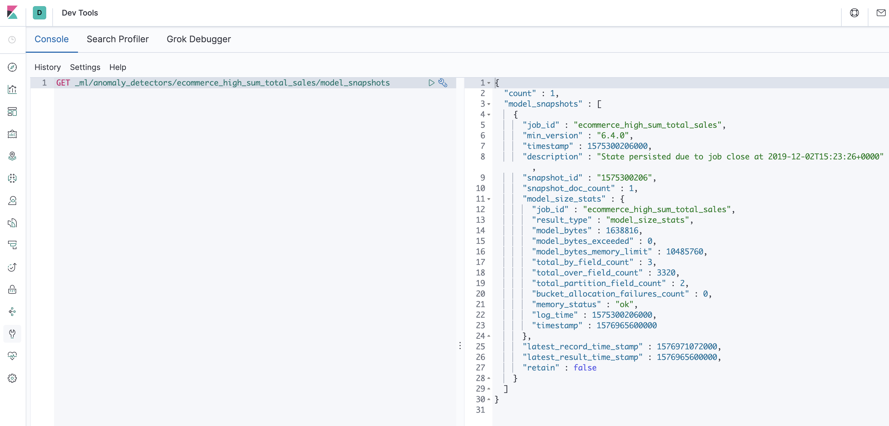
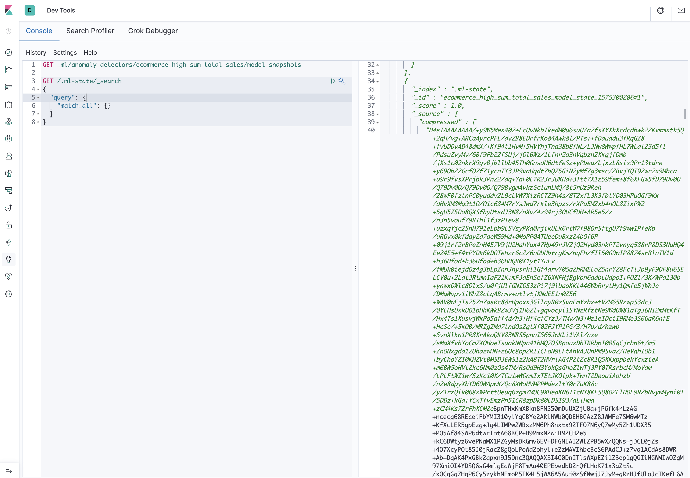
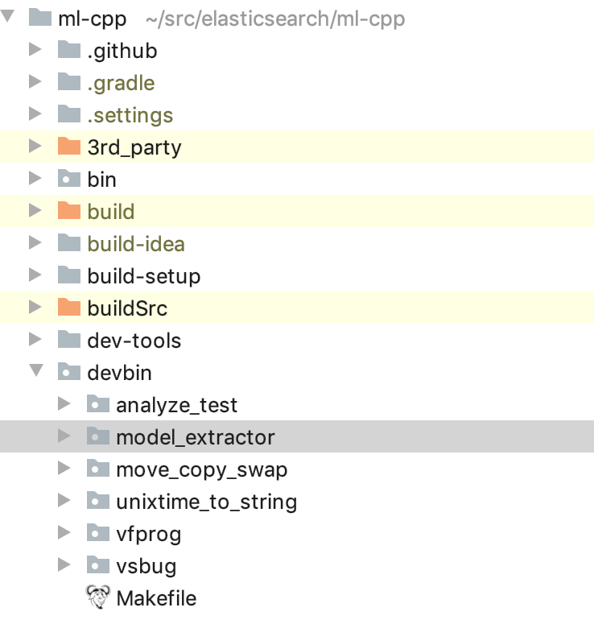
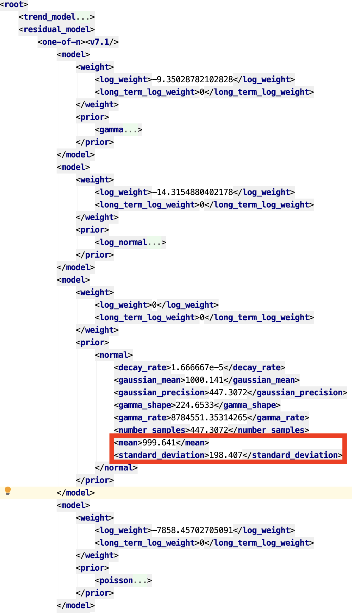
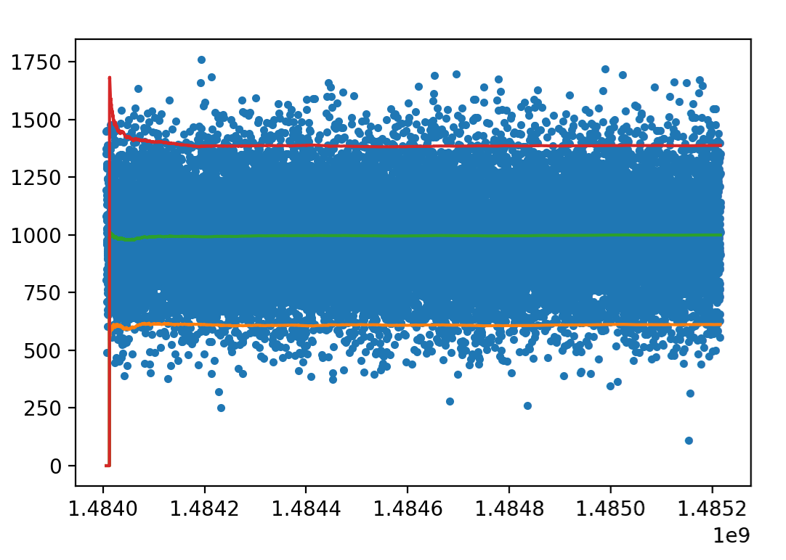
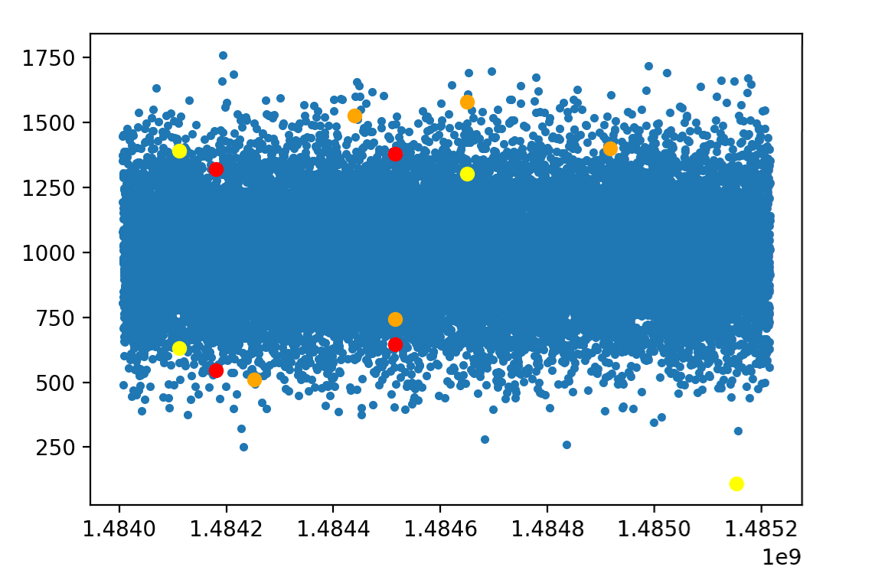
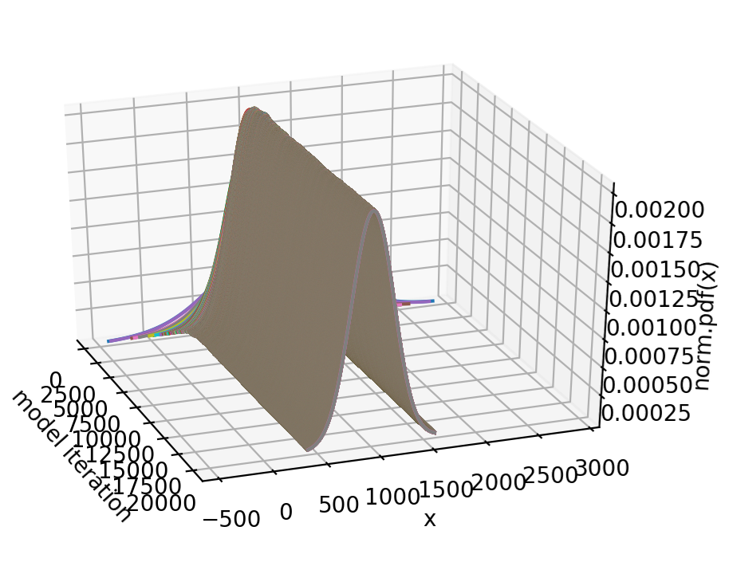
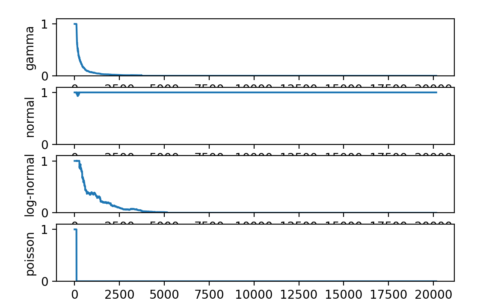
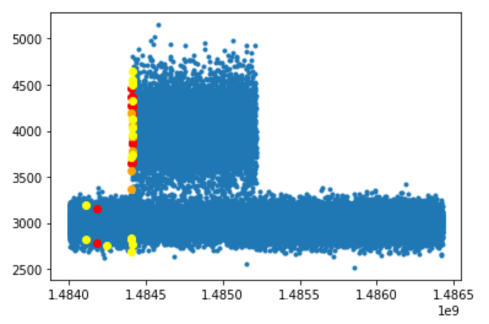

Ever wondered what's _really_ going on behind the scenes with Elastic's
unsupervised machine learning anomaly detection modelling? (and if not
why not?!) Sure you may think you know what's going on, you've read our
extensive and beautifully written
[documentation](https://www.elastic.co/guide/en/elastic-stack-overview/current/xpack-ml.html),
you've maybe even enabled
[model plot](https://www.elastic.co/guide/en/elasticsearch/reference/current/ml-job-resource.html#ml-apimodelplotconfig)
in the job configuration and [viewed the results in the single metric
viewer](https://www.elastic.co/guide/en/kibana/current/xpack-ml-anomalies.html)
(but do you understand what that's telling you, really?). Maybe you've
even downloaded the backend
[source code](https://github.com/elastic/ml-cpp) ,
[compiled it](https://github.com/elastic/ml-cpp/blob/master/CONTRIBUTING.md)
, and ran the extensive tests (and if you have kudos to you!) but do you
actually understand what those tests are about? If any of this sounds
like you, or you're just mildly curious, please read on.

For many reasons, the anomaly detector mode state is [snapshotted
periodically](https://www.elastic.co/guide/en/elasticsearch/reference/current/ml-snapshot-resource.html).
You can even view this these model snapshots in elasticsearch



but unless you can easily decode the base64 encoded, compressed model
state you probably won't learn very much from looking at it



The good news is that you don't need to worry about doing that anymore.
Hidden away in the [ml-cpp](https://github.com/elastic/ml-cpp) repository is a little tool with big
aspirations. The `model_extractor` source code lives in the `devbin`
directory



One of  `model_extractor`'s goals is to fill the gap between the
aforementioned unit tests and the extensive integration tests in
elasticsearch and not forgetting the quite frankly heroic efforts of the
Machine Learning QA team (seriously, these guys are the unsung heroes,
slaving away behind the scenes, who make each
[release](https://www.elastic.co/blog/elasticsearch-7-5-0-released) what
it is.)

Its design and implementation is simple. Using the existing `ml-cpp`
APIs it decodes the compressed model state generated by the primary
anomaly detector executable `autodetect`. Once this is done the model
state can be dumped to a file in human readable format (either `XML` or
`JSON`) and easily parsed by any number of scripting languages such as
`perl` or `python`. It can even do this at regular periodic intervals.
We'll see how to do exactly that soon.

If you were really keen you could even parse the model state and display
the evolution of model parameters over time. Which incidentally, is
exactly what I've done and am keen to share some of the more interesting
aspects with you now.

Perhaps the simplest example of an anomaly detection job is called
`simple count`. This detector... well I guess the clue is in the name,
right? As a first foray in to what `model_extractor` can show us about
the evolution of model parameters let's set up an anomaly detection job
on the command line (I hope I haven't lost anyone with those words? Stay
with me...) and pass in a similarly simple data set contained in a CSV
file consisting of two columns: the first is a time stamp and the second
is an integer representing a count of something (I'll leave it up to you
to think of what the count might represent, but do be creative. It is
the festive season after all! ). I said the data set would be simple so
let's make those counts adhere to a normal distribution (what is
"normal" anyway? who's the judge? At Elastic we say ["you do you and
that's ok"](https://www.elastic.co/blog/diversity-and-inclusion-at-elasticon-2018).)

Unless you just happen to have a CSV file containing a normally
distributed timeseries of counts just lying around you probably will
find you'll have to create one yourself. Here's one I created earlier.

```bash
time,count
1484006400,1352
1484006460,1080
1484006520,1195
1484006580,1448
1484006640,1373
1484006700,804
1484006760,1190
1484006820,969
1484006880,979
```

This was done using `python`

```python
# 2017-01-10T00:00:00+00:00
start_time = 1484006400

# Set seed for consistent results
np.random.seed(0)

bucket_span = 60

num_buckets = 14 * 24 * 60

end_time = start_time + (num_buckets * bucket_span)

# create n samples
mu = 1000
sigma = 200
samples = np.random.normal(mu, sigma, size=num_buckets)

print(len(samples))

# convert to integer
samples = samples.astype(int)

times = range(start_time, end_time, bucket_span)

print(len(times))
```

As you can see, this code snippet generates a normal distribution with
`mu` of 1000 and `sigma` of 200. Remember that, it will come in handy later.

Using this approach, you could generate many different kinds of
synthetic datasets that exercised different aspects of `autodetect`'s
modelling. For example you could potentially generate datasets that were
of `log-normal`, `gamma` or `poisson` distribution, or any combination
of these. The possibilities are endless! (ok, maybe not endless, stats
never was my strong point!) But let's keep things simple for now.

Speaking of simple. Let's simply dive right in and look at how to run
`autodetect` in a "pipeline" withe `model_extractor` in order to extract
model state after every bucket has been processed. Here's what the
command line for running that anomaly detection job from the command
line might look like:

```
autodetect --jobid=test --bucketspan=60 --summarycountfield=count --timefield=time --delimiter=, --modelplotconfig=modelplotconfig.conf --fieldconfig=fieldconfig.conf --persist=normal.pipe --persistIsPipe --bucketPersistInterval=1 --persistInForeground --input=normal.csv --output=normal.out
```

Where the contents of `modelplotconfig.conf` is

```bash
boundspercentile = 95.0
terms =
```

and `fieldconfig.conf` contains

```bash
detector.0.clause = count
```


Simple, right? No? Some explanation might help. Fortunately all is
explained in the
[README.md](https://github.com/elastic/ml-cpp/blob/master/README.md)
file at the root of the `ml-cpp` repository. Incidentally, the
`modelplotconfig.conf` configuration is the same as that used when you
select the `generate model plot` option when creating a job in our super
easy-to-use
[anomaly detector job wizard in Kibana](https://www.elastic.co/guide/en/elastic-stack-overview/7.5/create-jobs.html)
and this helps explain the mystery of what the model plot bounds
actually represent - they indicate that the confidence level of a point
being "in the shaded area" in the single metric plot is 95%. Finally, I
think the `fieldconfig.conf` configuration speaks for itself.

And here is the corresponding command line for the `model_extractor`:

```bash
model_extractor --input=normal_named_pipe --inputIsPipe --output=normal.xml --outputFormat=XML
```

Again some explanation might help you understand what's going on

```bash
./model_extractor --help
Usage: model_extractor [options]
Options::
  --help                     Display this information and exit
  --version                  Display version information and exit
  --logProperties arg        Optional logger properties file
  --input arg                Optional file to read input from - not present
                             means read from STDIN
  --inputIsPipe              Specified input file is a named pipe
  --output arg               Optional file to write output to - not present
                             means write to STDOUT
  --outputIsPipe             Specified output file is a named pipe
  --outputFormat arg (=JSON) Format of output documents [JSON|XML].
```

Let's put that all together. If you were doing this in say `python`, you
would probably have a method that looked something like this

```python
    def run_model_extractor(self):
        autodetect = cpp_exe_dir() + "/autodetect"
        model_extractor = cpp_src_home() + "/devbin/model_extractor/model_extractor"

        log = self.cfg.prefix + '.log'
        log_file = open(log, 'w')

        subprocess.Popen(
            [model_extractor, '--input', self.cfg.prefix + '_named_pipe', '--inputIsPipe', '--output',
             self.cfg.prefix + '.xml', '--outputFormat', 'XML'],
            stdout=subprocess.PIPE, close_fds=True)
        print("model_extractor spawned")

        subprocess.run(
            [autodetect, '--jobid=test', '--bucketspan={:d}'.format(self.cfg.bucket_span), '--summarycountfield=count',
             '--timefield='+self.cfg.time_field, '--delimiter=,', '--modelplotconfig=modelplotconfig.conf',
             '--fieldconfig=fieldconfig.conf', '--persist', self.cfg.prefix + '_named_pipe',
             '--persistIsPipe',
             '--bucketPersistInterval={:d}'.format(self.cfg.bucket_persist_interval), '--persistInForeground',
             '--input=' + self.cfg.csv_file,
             '--output=' + self.cfg.prefix + '.out'],
            stderr=log_file)

        print("autodetect complete")

        print(subprocess.run(['ls', '-lrt'], stdout=subprocess.PIPE).stdout.decode('utf-8'))
```

but those details aren't that important right now.

What is important is the output from `model_extractor`. We told it to
write the decoded model state data to an `XML` file called `normal.xml`.
Let's take a look at that file. Here's the first three model state dumps
in the file:

```xml
{"index":{"_id":"job_model_state_1484006460"}}
{"xml":"<root><trend_model><time_series_decomposition><6.3/><time_shift>0</time_shift><last_value_time>1484006430</last_value_time><last_propagation_time>1484006430</last_propagation_time><periodicity_test><periodicity_test_machine><state>1</state></periodicity_test_machine><short_window><bucket_length_index>0</bucket_length_index><start_time>1484006400</start_time><bucket_values><size>336</size><a>3.333334e-2:1352</a><a>0:0</a><a>0:0</a><a>0:0</a><a>0:0</a><a>0:0</a><a>0:0</a><a>0:0</a><a>0:0</a><a>0:0</a><a>0:0</a><a>0:0</a><a>0:0</a><a>0:0</a><a>0:0</a><a>0:0</a><a>0:0</a><a>0:0</a><a>0:0</a><a>0:0</a><a>0:0</a><a>0:0</a><a>0:0</a><a>0:0</a><a>0:0</a><a>0:0</a><a>0:0</a><a>0:0</a><a>0:0</a><a>0:0</a><a>0:0</a><a>0:0</a><a>0:0</a><a>0:0</a><a>0:0</a><a>0:0</a><a>0:0</a><a>0:0</a><a>0:0</a><a>0:0</a><a>0:0</a><a>0:0</a><a>0:0</a><a>0:0</a><a>0:0</a><a>0:0</a><a>0:0</a><a>0:0</a><a>0:0</a><a>0:0</a><a>0:0</a><a>0:0</a><a>0:0</a><a>0:0</a><a>0:0</a><a>0:0</a><a>0:0</a><a>0:0</a><a>0:0</a><a>0:0</a><a>0:0</a><a>0:0</a><a>0:0</a><a>0:0</a><a>0:0</a><a>0:0</a><a>0:0</a><a>0:0</a><a>0:0</a><a>0:0</a><a>0:0</a><a>0:0</a><a>0:0</a><a>0:0</a><a>0:0</a><a>0:0</a><a>0:0</a><a>0:0</a><a>0:0</a><a>0:0</a><a>0:0</a><a>0:0</a><a>0:0</a><a>0:0</a><a>0:0</a><a>0:0</a><a>0:0</a><a>0:0</a><a>0:0</a><a>0:0</a><a>0:0</a><a>0:0</a><a>0:0</a><a>0:0</a><a>0:0</a><a>0:0</a><a>0:0</a><a>0:0</a><a>0:0</a><a>0:0</a><a>0:0</a><a>0:0</a><a>0:0</a><a>0:0</a><a>0:0</a><a>0:0</a><a>0:0</a><a>0:0</a><a>0:0</a><a>0:0</a><a>0:0</a><a>0:0</a><a>0:0</a><a>0:0</a><a>0:0</a><a>0:0</a><a>0:0</a><a>0:0</a><a>0:0</a><a>0:0</a><a>0:0</a><a>0:0</a><a>0:0</a><a>0:0</a><a>0:0</a><a>0:0</a><a>0:0</a><a>0:0</a><a>0:0</a><a>0:0</a><a>0:0</a><a>0:0</a><a>0:0</a><a>0:0</a><a>0:0</a><a>0:0</a><a>0:0</a><a>0:0</a><a>0:0</a><a>0:0</a><a>0:0</a><a>0:0</a><a>0:0</a><a>0:0</a><a>0:0</a><a>0:0</a><a>0:0</a><a>0:0</a><a>0:0</a><a>0:0</a><a>0:0</a><a>0:0</a><a>0:0</a><a>0:0</a><a>0:0</a><a>0:0</a><a>0:0</a><a>0:0</a><a>0:0</a><a>0:0</a><a>0:0</a><a>0:0</a><a>0:0</a><a>0:0</a><a>0:0</a><a>0:0</a><a>0:0</a><a>0:0</a><a>0:0</a><a>0:0</a><a>0:0</a><a>0:0</a><a>0:0</a><a>0:0</a><a>0:0</a><a>0:0</a><a>0:0</a><a>0:0</a><a>0:0</a><a>0:0</a><a>0:0</a><a>0:0</a><a>0:0</a><a>0:0</a><a>0:0</a><a>0:0</a><a>0:0</a><a>0:0</a><a>0:0</a><a>0:0</a><a>0:0</a><a>0:0</a><a>0:0</a><a>0:0</a><a>0:0</a><a>0:0</a><a>0:0</a><a>0:0</a><a>0:0</a><a>0:0</a><a>0:0</a><a>0:0</a><a>0:0</a><a>0:0</a><a>0:0</a><a>0:0</a><a>0:0</a><a>0:0</a><a>0:0</a><a>0:0</a><a>0:0</a><a>0:0</a><a>0:0</a><a>0:0</a><a>0:0</a><a>0:0</a><a>0:0</a><a>0:0</a><a>0:0</a><a>0:0</a><a>0:0</a><a>0:0</a><a>0:0</a><a>0:0</a><a>0:0</a><a>0:0</a><a>0:0</a><a>0:0</a><a>0:0</a><a>0:0</a><a>0:0</a><a>0:0</a><a>0:0</a><a>0:0</a><a>0:0</a><a>0:0</a><a>0:0</a><a>0:0</a><a>0:0</a><a>0:0</a><a>0:0</a><a>0:0</a><a>0:0</a><a>0:0</a><a>0:0</a><a>0:0</a><a>0:0</a><a>0:0</a><a>0:0</a><a>0:0</a><a>0:0</a><a>0:0</a><a>0:0</a><a>0:0</a><a>0:0</a><a>0:0</a><a>0:0</a><a>0:0</a><a>0:0</a><a>0:0</a><a>0:0</a><a>0:0</a><a>0:0</a><a>0:0</a><a>0:0</a><a>0:0</a><a>0:0</a><a>0:0</a><a>0:0</a><a>0:0</a><a>0:0</a><a>0:0</a><a>0:0</a><a>0:0</a><a>0:0</a><a>0:0</a><a>0:0</a><a>0:0</a><a>0:0</a><a>0:0</a><a>0:0</a><a>0:0</a><a>0:0</a><a>0:0</a><a>0:0</a><a>0:0</a><a>0:0</a><a>0:0</a><a>0:0</a><a>0:0</a><a>0:0</a><a>0:0</a><a>0:0</a><a>0:0</a><a>0:0</a><a>0:0</a><a>0:0</a><a>0:0</a><a>0:0</a><a>0:0</a><a>0:0</a><a>0:0</a><a>0:0</a><a>0:0</a><a>0:0</a><a>0:0</a><a>0:0</a><a>0:0</a><a>0:0</a><a>0:0</a><a>0:0</a><a>0:0</a><a>0:0</a><a>0:0</a><a>0:0</a><a>0:0</a><a>0:0</a><a>0:0</a><a>0:0</a><a>0:0</a><a>0:0</a><a>0:0</a><a>0:0</a><a>0:0</a><a>0:0</a><a>0:0</a><a>0:0</a><a>0:0</a><a>0:0</a><a>0:0</a><a>0:0</a><a>0:0</a><a>0:0</a><a>0:0</a><a>0:0</a><a>0:0</a></bucket_values><mean_offset>1:30</mean_offset></short_window><long_window><bucket_length_index>0</bucket_length_index><start_time>1484006400</start_time><bucket_values><size>336</size><a>3.333334e-2:1352</a><a>0:0</a><a>0:0</a><a>0:0</a><a>0:0</a><a>0:0</a><a>0:0</a><a>0:0</a><a>0:0</a><a>0:0</a><a>0:0</a><a>0:0</a><a>0:0</a><a>0:0</a><a>0:0</a><a>0:0</a><a>0:0</a><a>0:0</a><a>0:0</a><a>0:0</a><a>0:0</a><a>0:0</a><a>0:0</a><a>0:0</a><a>0:0</a><a>0:0</a><a>0:0</a><a>0:0</a><a>0:0</a><a>0:0</a><a>0:0</a><a>0:0</a><a>0:0</a><a>0:0</a><a>0:0</a><a>0:0</a><a>0:0</a><a>0:0</a><a>0:0</a><a>0:0</a><a>0:0</a><a>0:0</a><a>0:0</a><a>0:0</a><a>0:0</a><a>0:0</a><a>0:0</a><a>0:0</a><a>0:0</a><a>0:0</a><a>0:0</a><a>0:0</a><a>0:0</a><a>0:0</a><a>0:0</a><a>0:0</a><a>0:0</a><a>0:0</a><a>0:0</a><a>0:0</a><a>0:0</a><a>0:0</a><a>0:0</a><a>0:0</a><a>0:0</a><a>0:0</a><a>0:0</a><a>0:0</a><a>0:0</a><a>0:0</a><a>0:0</a><a>0:0</a><a>0:0</a><a>0:0</a><a>0:0</a><a>0:0</a><a>0:0</a><a>0:0</a><a>0:0</a><a>0:0</a><a>0:0</a><a>0:0</a><a>0:0</a><a>0:0</a><a>0:0</a><a>0:0</a><a>0:0</a><a>0:0</a><a>0:0</a><a>0:0</a><a>0:0</a><a>0:0</a><a>0:0</a><a>0:0</a><a>0:0</a><a>0:0</a><a>0:0</a><a>0:0</a><a>0:0</a><a>0:0</a><a>0:0</a><a>0:0</a><a>0:0</a><a>0:0</a><a>0:0</a><a>0:0</a><a>0:0</a><a>0:0</a><a>0:0</a><a>0:0</a><a>0:0</a><a>0:0</a><a>0:0</a><a>0:0</a><a>0:0</a><a>0:0</a><a>0:0</a><a>0:0</a><a>0:0</a><a>0:0</a><a>0:0</a><a>0:0</a><a>0:0</a><a>0:0</a><a>0:0</a><a>0:0</a><a>0:0</a><a>0:0</a><a>0:0</a><a>0:0</a><a>0:0</a><a>0:0</a><a>0:0</a><a>0:0</a><a>0:0</a><a>0:0</a><a>0:0</a><a>0:0</a><a>0:0</a><a>0:0</a><a>0:0</a><a>0:0</a><a>0:0</a><a>0:0</a><a>0:0</a><a>0:0</a><a>0:0</a><a>0:0</a><a>0:0</a><a>0:0</a><a>0:0</a><a>0:0</a><a>0:0</a><a>0:0</a><a>0:0</a><a>0:0</a><a>0:0</a><a>0:0</a><a>0:0</a><a>0:0</a><a>0:0</a><a>0:0</a><a>0:0</a><a>0:0</a><a>0:0</a><a>0:0</a><a>0:0</a><a>0:0</a><a>0:0</a><a>0:0</a><a>0:0</a><a>0:0</a><a>0:0</a><a>0:0</a><a>0:0</a><a>0:0</a><a>0:0</a><a>0:0</a><a>0:0</a><a>0:0</a><a>0:0</a><a>0:0</a><a>0:0</a><a>0:0</a><a>0:0</a><a>0:0</a><a>0:0</a><a>0:0</a><a>0:0</a><a>0:0</a><a>0:0</a><a>0:0</a><a>0:0</a><a>0:0</a><a>0:0</a><a>0:0</a><a>0:0</a><a>0:0</a><a>0:0</a><a>0:0</a><a>0:0</a><a>0:0</a><a>0:0</a><a>0:0</a><a>0:0</a><a>0:0</a><a>0:0</a><a>0:0</a><a>0:0</a><a>0:0</a><a>0:0</a><a>0:0</a><a>0:0</a><a>0:0</a><a>0:0</a><a>0:0</a><a>0:0</a><a>0:0</a><a>0:0</a><a>0:0</a><a>0:0</a><a>0:0</a><a>0:0</a><a>0:0</a><a>0:0</a><a>0:0</a><a>0:0</a><a>0:0</a><a>0:0</a><a>0:0</a><a>0:0</a><a>0:0</a><a>0:0</a><a>0:0</a><a>0:0</a><a>0:0</a><a>0:0</a><a>0:0</a><a>0:0</a><a>0:0</a><a>0:0</a><a>0:0</a><a>0:0</a><a>0:0</a><a>0:0</a><a>0:0</a><a>0:0</a><a>0:0</a><a>0:0</a><a>0:0</a><a>0:0</a><a>0:0</a><a>0:0</a><a>0:0</a><a>0:0</a><a>0:0</a><a>0:0</a><a>0:0</a><a>0:0</a><a>0:0</a><a>0:0</a><a>0:0</a><a>0:0</a><a>0:0</a><a>0:0</a><a>0:0</a><a>0:0</a><a>0:0</a><a>0:0</a><a>0:0</a><a>0:0</a><a>0:0</a><a>0:0</a><a>0:0</a><a>0:0</a><a>0:0</a><a>0:0</a><a>0:0</a><a>0:0</a><a>0:0</a><a>0:0</a><a>0:0</a><a>0:0</a><a>0:0</a><a>0:0</a><a>0:0</a><a>0:0</a><a>0:0</a><a>0:0</a><a>0:0</a><a>0:0</a><a>0:0</a><a>0:0</a><a>0:0</a><a>0:0</a><a>0:0</a><a>0:0</a><a>0:0</a><a>0:0</a><a>0:0</a><a>0:0</a><a>0:0</a><a>0:0</a><a>0:0</a><a>0:0</a><a>0:0</a><a>0:0</a><a>0:0</a><a>0:0</a><a>0:0</a><a>0:0</a><a>0:0</a><a>0:0</a><a>0:0</a><a>0:0</a><a>0:0</a><a>0:0</a><a>0:0</a><a>0:0</a><a>0:0</a><a>0:0</a><a>0:0</a><a>0:0</a><a>0:0</a><a>0:0</a><a>0:0</a><a>0:0</a><a>0:0</a><a>0:0</a><a>0:0</a><a>0:0</a><a>0:0</a><a>0:0</a><a>0:0</a><a>0:0</a><a>0:0</a></bucket_values><mean_offset>1:30</mean_offset></long_window><linear_scales><size>0</size></linear_scales></periodicity_test><calendar_cyclic_test><calendar_test_machine><state>1</state></calendar_test_machine><last_month>2</last_month><calendar_test><6.4/><error_quantiles><unsorted>1</unsorted><knots>1352;3.333334e-2</knots><count>3.333334e-2</count></error_quantiles><current_bucket_time>0</current_bucket_time><current_bucket_index>0</current_bucket_index><current_bucket_error_stats>0,0,0</current_bucket_error_stats><errors><size>155</size><a>0,0,0</a><a>0,0,0</a><a>0,0,0</a><a>0,0,0</a><a>0,0,0</a><a>0,0,0</a><a>0,0,0</a><a>0,0,0</a><a>0,0,0</a><a>0,0,0</a><a>0,0,0</a><a>0,0,0</a><a>0,0,0</a><a>0,0,0</a><a>0,0,0</a><a>0,0,0</a><a>0,0,0</a><a>0,0,0</a><a>0,0,0</a><a>0,0,0</a><a>0,0,0</a><a>0,0,0</a><a>0,0,0</a><a>0,0,0</a><a>0,0,0</a><a>0,0,0</a><a>0,0,0</a><a>0,0,0</a><a>0,0,0</a><a>0,0,0</a><a>0,0,0</a><a>0,0,0</a><a>0,0,0</a><a>0,0,0</a><a>0,0,0</a><a>0,0,0</a><a>0,0,0</a><a>0,0,0</a><a>0,0,0</a><a>0,0,0</a><a>0,0,0</a><a>0,0,0</a><a>0,0,0</a><a>0,0,0</a><a>0,0,0</a><a>0,0,0</a><a>0,0,0</a><a>0,0,0</a><a>0,0,0</a><a>0,0,0</a><a>0,0,0</a><a>0,0,0</a><a>0,0,0</a><a>0,0,0</a><a>0,0,0</a><a>0,0,0</a><a>0,0,0</a><a>0,0,0</a><a>0,0,0</a><a>0,0,0</a><a>0,0,0</a><a>0,0,0</a><a>0,0,0</a><a>0,0,0</a><a>0,0,0</a><a>0,0,0</a><a>0,0,0</a><a>0,0,0</a><a>0,0,0</a><a>0,0,0</a><a>0,0,0</a><a>0,0,0</a><a>0,0,0</a><a>0,0,0</a><a>0,0,0</a><a>0,0,0</a><a>0,0,0</a><a>0,0,0</a><a>0,0,0</a><a>0,0,0</a><a>0,0,0</a><a>0,0,0</a><a>0,0,0</a><a>0,0,0</a><a>0,0,0</a><a>0,0,0</a><a>0,0,0</a><a>0,0,0</a><a>0,0,0</a><a>0,0,0</a><a>0,0,0</a><a>0,0,0</a><a>0,0,0</a><a>0,0,0</a><a>0,0,0</a><a>0,0,0</a><a>0,0,0</a><a>0,0,0</a><a>0,0,0</a><a>0,0,0</a><a>0,0,0</a><a>0,0,0</a><a>0,0,0</a><a>0,0,0</a><a>0,0,0</a><a>0,0,0</a><a>0,0,0</a><a>0,0,0</a><a>0,0,0</a><a>0,0,0</a><a>0,0,0</a><a>0,0,0</a><a>0,0,0</a><a>0,0,0</a><a>0,0,0</a><a>0,0,0</a><a>0,0,0</a><a>0,0,0</a><a>0,0,0</a><a>0,0,0</a><a>0,0,0</a><a>0,0,0</a><a>0,0,0</a><a>0,0,0</a><a>0,0,0</a><a>0,0,0</a><a>0,0,0</a><a>0,0,0</a><a>0,0,0</a><a>0,0,0</a><a>0,0,0</a><a>0,0,0</a><a>0,0,0</a><a>0,0,0</a><a>0,0,0</a><a>0,0,0</a><a>0,0,0</a><a>0,0,0</a><a>0,0,0</a><a>0,0,0</a><a>0,0,0</a><a>0,0,0</a><a>0,0,0</a><a>0,0,0</a><a>0,0,0</a><a>0,0,0</a><a>0,0,0</a><a>0,0,0</a><a>0,0,0</a><a>0,0,0</a><a>0,0,0</a><a>0,0,0</a><a>0,0,0</a><a>0,0,0</a><a>0,0,0</a></errors></calendar_test></calendar_cyclic_test><components><6.3/><components_machine><state>1</state></components_machine><decay_rate>1.2e-2</decay_rate><gain_controller><regression_origin>1479945600</regression_origin><mean_sum_amplitudes>0:0</mean_sum_amplitudes><mean_sum_amplitudes_trend><statistic>0:0,0,0,0,0</statistic></mean_sum_amplitudes_trend></gain_controller><trend><target_decay_rate>0.012000</target_decay_rate><first_update>1484006430</first_update><last_update>1484006430</last_update><regression_origin>1483574400</regression_origin><model><7.1/><weight>1:6.944444e-3</weight><regression><statistic>3.333334e-2:1,7.14335317460317e-1,5.10274945771132e-1,3.64507415379468e-1,2.60380520281732e-1,1352,965.781349206349,689.891726682571</statistic></regression><mse>3.333334e-2:1827904,1827904,1827904</mse></model><model><7.1/><weight>1:1.388889e-2</weight><regression><statistic>3.333334e-2:1,7.14335317460317e-1,5.10274945771132e-1,3.64507415379468e-1,2.60380520281732e-1,1352,965.781349206349,689.891726682571</statistic></regression><mse>3.333334e-2:1827904,1827904,1827904</mse></model><model><7.1/><weight>1:2.777778e-2</weight><regression><statistic>3.333334e-2:1,7.14335317460317e-1,5.10274945771132e-1,3.64507415379468e-1,2.60380520281732e-1,1352,965.781349206349,689.891726682571</statistic></regression><mse>3.333334e-2:1827904,1827904,1827904</mse></model><model><7.1/><weight>1:8.333334e-2</weight><regression><statistic>3.333334e-2:1,7.14335317460317e-1,5.10274945771132e-1,3.64507415379468e-1,2.60380520281732e-1,1352,965.781349206349,689.891726682571</statistic></regression><mse>3.333334e-2:1827904,1827904,1827904</mse></model><model><7.1/><weight>1:2.5e-1</weight><regression><statistic>3.333334e-2:1,7.14335317460317e-1,5.10274945771132e-1,3.64507415379468e-1,2.60380520281732e-1,1352,965.781349206349,689.891726682571</statistic></regression><mse>3.333334e-2:1827904,1827904,1827904</mse></model><model><7.1/><weight>1:1</weight><regression><statistic>3.333334e-2:1,7.14335317460317e-1,5.10274945771132e-1,3.64507415379468e-1,2.60380520281732e-1,1352,965.781349206349,689.891726682571</statistic></regression><mse>3.333334e-2:1827904,1827904,1827904</mse></model><model><7.1/><weight>1:2.5e-1</weight><regression><statistic>3.333334e-2:1,7.14335317460317e-1,5.10274945771132e-1,3.64507415379468e-1,2.60380520281732e-1,1352,965.781349206349,689.891726682571</statistic></regression><mse>3.333334e-2:1827904,1827904,1827904</mse></model><model><7.1/><weight>1:5e-2</weight><regression><statistic>3.333334e-2:1,7.14335317460317e-1,5.10274945771132e-1,3.64507415379468e-1,2.60380520281732e-1,1352,965.781349206349,689.891726682571</statistic></regression><mse>3.333334e-2:1827904,1827904,1827904</mse></model><prediction_error_variance>0</prediction_error_variance><value_moments>3.333334e-2:1352:0</value_moments><time_of_last_level_change>0</time_of_last_level_change><probability_of_level_change_model><min_max_likelihood_to_use_feature>-20</min_max_likelihood_to_use_feature></probability_of_level_change_model><magnitude_of_level_change_model><decay_rate>1.2e-2</decay_rate><gaussian_mean>0</gaussian_mean><gaussian_precision>0</gaussian_precision><gamma_shape>1</gamma_shape><gamma_rate>0</gamma_rate><number_samples>0</number_samples><mean>&lt;unknown&gt;</mean><standard_deviation>&lt;unknown&gt;</standard_deviation></magnitude_of_level_change_model></trend><mean_variance_scale>3.333334e-2:1</mean_variance_scale><moments>3.333334e-2:1352:0</moments><moments_minus_trend>3.333334e-2:1352:0</moments_minus_trend><testing_for_change>false</testing_for_change><using_trend_for_prediction>false</using_trend_for_prediction></components></time_series_decomposition></trend_model><residual_model><one-of-n><7.1/><model><weight><log_weight>0</log_weight><long_term_log_weight>0</long_term_log_weight></weight><prior><gamma><decay_rate>1.666667e-5</decay_rate><offset>1e-1</offset><likelihood_shape>1</likelihood_shape><log_samples_mean>3.33333333333333e-2:7.20978392236746</log_samples_mean><sample_moments>3.33333333333333e-2:1352.60000000149:0</sample_moments><prior_shape>1</prior_shape><prior_rate>0</prior_rate><number_samples>3.333334e-2</number_samples><mean>&lt;unknown&gt;</mean><standard_deviation>&lt;unknown&gt;</standard_deviation></gamma></prior></model><model><weight><log_weight>0</log_weight><long_term_log_weight>0</long_term_log_weight></weight><prior><log_normal><decay_rate>1.666667e-5</decay_rate><offset>1</offset><gaussian_mean>7.210449</gaussian_mean><gaussian_precision>3.333111e-2</gaussian_precision><gamma_shape>1.016666</gamma_shape><gamma_rate>7.58141964714308e-10</gamma_rate><number_samples>3.333111e-2</number_samples><mean>1352.5</mean><standard_deviation>0.2057971</standard_deviation></log_normal></prior></model><model><weight><log_weight>0</log_weight><long_term_log_weight>0</long_term_log_weight></weight><prior><normal><decay_rate>1.666667e-5</decay_rate><gaussian_mean>1352.5</gaussian_mean><gaussian_precision>3.333111e-2</gaussian_precision><gamma_shape>1.016666</gamma_shape><gamma_rate>1.38888737104836e-3</gamma_rate><number_samples>3.333111e-2</number_samples><mean>1352</mean><standard_deviation>1.607356</standard_deviation></normal></prior></model><model><weight><log_weight>0</log_weight><long_term_log_weight>0</long_term_log_weight></weight><prior><poisson><decay_rate>1.666667e-5</decay_rate><offset>0</offset><shape>45.16366</shape><rate>3.333112e-2</rate><number_samples>3.333111e-2</number_samples><mean>1355</mean><standard_deviation>204.9578</standard_deviation></poisson></prior></model><model><weight><log_weight>-1.79755531839993e308</log_weight><long_term_log_weight>0</long_term_log_weight></weight><prior><multimodal><clusterer><x_means_online_1d><cluster><index>0</index><prior><decay_rate>1.666667e-5</decay_rate><gaussian_mean>1352.5</gaussian_mean><gaussian_precision>3.333334e-2</gaussian_precision><gamma_shape>1.016667</gamma_shape><gamma_rate>1.38888888888889e-3</gamma_rate><number_samples>3.333334e-2</number_samples><mean>1352</mean><standard_deviation>1.607259</standard_deviation></prior><structure><decay_rate>1.666667e-5</decay_rate><space>12</space><category><size>0</size></category><points>1352;3.333334e-2</points></structure></cluster><available_distributions>7</available_distributions><decay_rate>1.666667e-5</decay_rate><history_length>0</history_length><smallest>1352</smallest><largest>1352</largest><weight>1</weight><cluster_fraction>5e-2</cluster_fraction><minimum_cluster_count>12</minimum_cluster_count><winsorisation_confidence_interval>1</winsorisation_confidence_interval><index_generator><index>1</index></index_generator></x_means_online_1d></clusterer><seed_prior><one-of-n><7.1/><model><weight><log_weight>0</log_weight><long_term_log_weight>0</long_term_log_weight></weight><prior><gamma><decay_rate>1.666667e-5</decay_rate><offset>1e-1</offset><likelihood_shape>1</likelihood_shape><log_samples_mean>0:0</log_samples_mean><sample_moments>0:0:0</sample_moments><prior_shape>1</prior_shape><prior_rate>0</prior_rate><number_samples>0</number_samples><mean>&lt;unknown&gt;</mean><standard_deviation>&lt;unknown&gt;</standard_deviation></gamma></prior></model><model><weight><log_weight>0</log_weight><long_term_log_weight>0</long_term_log_weight></weight><prior><log_normal><decay_rate>1.666667e-5</decay_rate><offset>1</offset><gaussian_mean>0</gaussian_mean><gaussian_precision>0</gaussian_precision><gamma_shape>1</gamma_shape><gamma_rate>0</gamma_rate><number_samples>0</number_samples><mean>&lt;unknown&gt;</mean><standard_deviation>&lt;unknown&gt;</standard_deviation></log_normal></prior></model><model><weight><log_weight>0</log_weight><long_term_log_weight>0</long_term_log_weight></weight><prior><normal><decay_rate>1.666667e-5</decay_rate><gaussian_mean>0</gaussian_mean><gaussian_precision>0</gaussian_precision><gamma_shape>1</gamma_shape><gamma_rate>0</gamma_rate><number_samples>0</number_samples><mean>&lt;unknown&gt;</mean><standard_deviation>&lt;unknown&gt;</standard_deviation></normal></prior></model><sample_moments>0:0:0</sample_moments><decay_rate>1.666667e-5</decay_rate><number_samples>0</number_samples></one-of-n></seed_prior><mode><index>0</index><prior><one-of-n><7.1/><model><weight><log_weight>0</log_weight><long_term_log_weight>0</long_term_log_weight></weight><prior><gamma><decay_rate>1.666667e-5</decay_rate><offset>1e-1</offset><likelihood_shape>1</likelihood_shape><log_samples_mean>3.33333333333333e-2:7.20978392236746</log_samples_mean><sample_moments>3.33333333333333e-2:1352.60000000149:0</sample_moments><prior_shape>1</prior_shape><prior_rate>0</prior_rate><number_samples>3.333334e-2</number_samples><mean>&lt;unknown&gt;</mean><standard_deviation>&lt;unknown&gt;</standard_deviation></gamma></prior></model><model><weight><log_weight>0</log_weight><long_term_log_weight>0</long_term_log_weight></weight><prior><log_normal><decay_rate>1.666667e-5</decay_rate><offset>1</offset><gaussian_mean>7.210449</gaussian_mean><gaussian_precision>3.333334e-2</gaussian_precision><gamma_shape>1.016667</gamma_shape><gamma_rate>7.58142793247006e-10</gamma_rate><number_samples>3.333334e-2</number_samples><mean>1352.5</mean><standard_deviation>0.2057905</standard_deviation></log_normal></prior></model><model><weight><log_weight>0</log_weight><long_term_log_weight>0</long_term_log_weight></weight><prior><normal><decay_rate>1.666667e-5</decay_rate><gaussian_mean>1352.5</gaussian_mean><gaussian_precision>3.333334e-2</gaussian_precision><gamma_shape>1.016667</gamma_shape><gamma_rate>1.38888888888889e-3</gamma_rate><number_samples>3.333334e-2</number_samples><mean>1352</mean><standard_deviation>1.607259</standard_deviation></normal></prior></model><sample_moments>3.333334e-2:1352:0</sample_moments><decay_rate>1.666667e-5</decay_rate><number_samples>3.333334e-2</number_samples></one-of-n></prior></mode><decay_rate>1.666667e-5</decay_rate><number_samples>3.333334e-2</number_samples></multimodal></prior></model><sample_moments>3.333111e-2:1352:0</sample_moments><decay_rate>1.666667e-5</decay_rate><number_samples>3.333111e-2</number_samples></one-of-n></residual_model></root>"}

{"index":{"_id":"job_model_state_1484007240"}}
{"xml":"<root><trend_model><time_series_decomposition><6.3/><time_shift>0</time_shift><last_value_time>1484007210</last_value_time><last_propagation_time>1484007210</last_propagation_time><periodicity_test><periodicity_test_machine><state>1</state></periodicity_test_machine><short_window><bucket_length_index>0</bucket_length_index><start_time>1484006400</start_time><bucket_values><size>336</size><a>3.333334e-2:1352</a><a>3.333334e-2:1080</a><a>3.333334e-2:1195</a><a>3.333334e-2:1448</a><a>3.333334e-2:1373</a><a>3.333334e-2:804</a><a>3.333334e-2:1190</a><a>3.333334e-2:969</a><a>3.333334e-2:979</a><a>3.333334e-2:1082</a><a>3.333334e-2:1028</a><a>3.333334e-2:1290</a><a>3.333334e-2:1152</a><a>3.333334e-2:1024</a><a>0:0</a><a>0:0</a><a>0:0</a><a>0:0</a><a>0:0</a><a>0:0</a><a>0:0</a><a>0:0</a><a>0:0</a><a>0:0</a><a>0:0</a><a>0:0</a><a>0:0</a><a>0:0</a><a>0:0</a><a>0:0</a><a>0:0</a><a>0:0</a><a>0:0</a><a>0:0</a><a>0:0</a><a>0:0</a><a>0:0</a><a>0:0</a><a>0:0</a><a>0:0</a><a>0:0</a><a>0:0</a><a>0:0</a><a>0:0</a><a>0:0</a><a>0:0</a><a>0:0</a><a>0:0</a><a>0:0</a><a>0:0</a><a>0:0</a><a>0:0</a><a>0:0</a><a>0:0</a><a>0:0</a><a>0:0</a><a>0:0</a><a>0:0</a><a>0:0</a><a>0:0</a><a>0:0</a><a>0:0</a><a>0:0</a><a>0:0</a><a>0:0</a><a>0:0</a><a>0:0</a><a>0:0</a><a>0:0</a><a>0:0</a><a>0:0</a><a>0:0</a><a>0:0</a><a>0:0</a><a>0:0</a><a>0:0</a><a>0:0</a><a>0:0</a><a>0:0</a><a>0:0</a><a>0:0</a><a>0:0</a><a>0:0</a><a>0:0</a><a>0:0</a><a>0:0</a><a>0:0</a><a>0:0</a><a>0:0</a><a>0:0</a><a>0:0</a><a>0:0</a><a>0:0</a><a>0:0</a><a>0:0</a><a>0:0</a><a>0:0</a><a>0:0</a><a>0:0</a><a>0:0</a><a>0:0</a><a>0:0</a><a>0:0</a><a>0:0</a><a>0:0</a><a>0:0</a><a>0:0</a><a>0:0</a><a>0:0</a><a>0:0</a><a>0:0</a><a>0:0</a><a>0:0</a><a>0:0</a><a>0:0</a><a>0:0</a><a>0:0</a><a>0:0</a><a>0:0</a><a>0:0</a><a>0:0</a><a>0:0</a><a>0:0</a><a>0:0</a><a>0:0</a><a>0:0</a><a>0:0</a><a>0:0</a><a>0:0</a><a>0:0</a><a>0:0</a><a>0:0</a><a>0:0</a><a>0:0</a><a>0:0</a><a>0:0</a><a>0:0</a><a>0:0</a><a>0:0</a><a>0:0</a><a>0:0</a><a>0:0</a><a>0:0</a><a>0:0</a><a>0:0</a><a>0:0</a><a>0:0</a><a>0:0</a><a>0:0</a><a>0:0</a><a>0:0</a><a>0:0</a><a>0:0</a><a>0:0</a><a>0:0</a><a>0:0</a><a>0:0</a><a>0:0</a><a>0:0</a><a>0:0</a><a>0:0</a><a>0:0</a><a>0:0</a><a>0:0</a><a>0:0</a><a>0:0</a><a>0:0</a><a>0:0</a><a>0:0</a><a>0:0</a><a>0:0</a><a>0:0</a><a>0:0</a><a>0:0</a><a>0:0</a><a>0:0</a><a>0:0</a><a>0:0</a><a>0:0</a><a>0:0</a><a>0:0</a><a>0:0</a><a>0:0</a><a>0:0</a><a>0:0</a><a>0:0</a><a>0:0</a><a>0:0</a><a>0:0</a><a>0:0</a><a>0:0</a><a>0:0</a><a>0:0</a><a>0:0</a><a>0:0</a><a>0:0</a><a>0:0</a><a>0:0</a><a>0:0</a><a>0:0</a><a>0:0</a><a>0:0</a><a>0:0</a><a>0:0</a><a>0:0</a><a>0:0</a><a>0:0</a><a>0:0</a><a>0:0</a><a>0:0</a><a>0:0</a><a>0:0</a><a>0:0</a><a>0:0</a><a>0:0</a><a>0:0</a><a>0:0</a><a>0:0</a><a>0:0</a><a>0:0</a><a>0:0</a><a>0:0</a><a>0:0</a><a>0:0</a><a>0:0</a><a>0:0</a><a>0:0</a><a>0:0</a><a>0:0</a><a>0:0</a><a>0:0</a><a>0:0</a><a>0:0</a><a>0:0</a><a>0:0</a><a>0:0</a><a>0:0</a><a>0:0</a><a>0:0</a><a>0:0</a><a>0:0</a><a>0:0</a><a>0:0</a><a>0:0</a><a>0:0</a><a>0:0</a><a>0:0</a><a>0:0</a><a>0:0</a><a>0:0</a><a>0:0</a><a>0:0</a><a>0:0</a><a>0:0</a><a>0:0</a><a>0:0</a><a>0:0</a><a>0:0</a><a>0:0</a><a>0:0</a><a>0:0</a><a>0:0</a><a>0:0</a><a>0:0</a><a>0:0</a><a>0:0</a><a>0:0</a><a>0:0</a><a>0:0</a><a>0:0</a><a>0:0</a><a>0:0</a><a>0:0</a><a>0:0</a><a>0:0</a><a>0:0</a><a>0:0</a><a>0:0</a><a>0:0</a><a>0:0</a><a>0:0</a><a>0:0</a><a>0:0</a><a>0:0</a><a>0:0</a><a>0:0</a><a>0:0</a><a>0:0</a><a>0:0</a><a>0:0</a><a>0:0</a><a>0:0</a><a>0:0</a><a>0:0</a><a>0:0</a><a>0:0</a><a>0:0</a><a>0:0</a><a>0:0</a><a>0:0</a><a>0:0</a><a>0:0</a><a>0:0</a><a>0:0</a><a>0:0</a><a>0:0</a><a>0:0</a><a>0:0</a><a>0:0</a><a>0:0</a><a>0:0</a><a>0:0</a><a>0:0</a><a>0:0</a><a>0:0</a><a>0:0</a><a>0:0</a><a>0:0</a><a>0:0</a><a>0:0</a><a>0:0</a><a>0:0</a><a>0:0</a><a>0:0</a><a>0:0</a><a>0:0</a><a>0:0</a><a>0:0</a><a>0:0</a><a>0:0</a><a>0:0</a><a>0:0</a><a>0:0</a><a>0:0</a><a>0:0</a><a>0:0</a></bucket_values><mean_offset>14:30</mean_offset></short_window><long_window><bucket_length_index>0</bucket_length_index><start_time>1484006400</start_time><bucket_values><size>336</size><a>4.666667e-1:1140.429</a><a>0:0</a><a>0:0</a><a>0:0</a><a>0:0</a><a>0:0</a><a>0:0</a><a>0:0</a><a>0:0</a><a>0:0</a><a>0:0</a><a>0:0</a><a>0:0</a><a>0:0</a><a>0:0</a><a>0:0</a><a>0:0</a><a>0:0</a><a>0:0</a><a>0:0</a><a>0:0</a><a>0:0</a><a>0:0</a><a>0:0</a><a>0:0</a><a>0:0</a><a>0:0</a><a>0:0</a><a>0:0</a><a>0:0</a><a>0:0</a><a>0:0</a><a>0:0</a><a>0:0</a><a>0:0</a><a>0:0</a><a>0:0</a><a>0:0</a><a>0:0</a><a>0:0</a><a>0:0</a><a>0:0</a><a>0:0</a><a>0:0</a><a>0:0</a><a>0:0</a><a>0:0</a><a>0:0</a><a>0:0</a><a>0:0</a><a>0:0</a><a>0:0</a><a>0:0</a><a>0:0</a><a>0:0</a><a>0:0</a><a>0:0</a><a>0:0</a><a>0:0</a><a>0:0</a><a>0:0</a><a>0:0</a><a>0:0</a><a>0:0</a><a>0:0</a><a>0:0</a><a>0:0</a><a>0:0</a><a>0:0</a><a>0:0</a><a>0:0</a><a>0:0</a><a>0:0</a><a>0:0</a><a>0:0</a><a>0:0</a><a>0:0</a><a>0:0</a><a>0:0</a><a>0:0</a><a>0:0</a><a>0:0</a><a>0:0</a><a>0:0</a><a>0:0</a><a>0:0</a><a>0:0</a><a>0:0</a><a>0:0</a><a>0:0</a><a>0:0</a><a>0:0</a><a>0:0</a><a>0:0</a><a>0:0</a><a>0:0</a><a>0:0</a><a>0:0</a><a>0:0</a><a>0:0</a><a>0:0</a><a>0:0</a><a>0:0</a><a>0:0</a><a>0:0</a><a>0:0</a><a>0:0</a><a>0:0</a><a>0:0</a><a>0:0</a><a>0:0</a><a>0:0</a><a>0:0</a><a>0:0</a><a>0:0</a><a>0:0</a><a>0:0</a><a>0:0</a><a>0:0</a><a>0:0</a><a>0:0</a><a>0:0</a><a>0:0</a><a>0:0</a><a>0:0</a><a>0:0</a><a>0:0</a><a>0:0</a><a>0:0</a><a>0:0</a><a>0:0</a><a>0:0</a><a>0:0</a><a>0:0</a><a>0:0</a><a>0:0</a><a>0:0</a><a>0:0</a><a>0:0</a><a>0:0</a><a>0:0</a><a>0:0</a><a>0:0</a><a>0:0</a><a>0:0</a><a>0:0</a><a>0:0</a><a>0:0</a><a>0:0</a><a>0:0</a><a>0:0</a><a>0:0</a><a>0:0</a><a>0:0</a><a>0:0</a><a>0:0</a><a>0:0</a><a>0:0</a><a>0:0</a><a>0:0</a><a>0:0</a><a>0:0</a><a>0:0</a><a>0:0</a><a>0:0</a><a>0:0</a><a>0:0</a><a>0:0</a><a>0:0</a><a>0:0</a><a>0:0</a><a>0:0</a><a>0:0</a><a>0:0</a><a>0:0</a><a>0:0</a><a>0:0</a><a>0:0</a><a>0:0</a><a>0:0</a><a>0:0</a><a>0:0</a><a>0:0</a><a>0:0</a><a>0:0</a><a>0:0</a><a>0:0</a><a>0:0</a><a>0:0</a><a>0:0</a><a>0:0</a><a>0:0</a><a>0:0</a><a>0:0</a><a>0:0</a><a>0:0</a><a>0:0</a><a>0:0</a><a>0:0</a><a>0:0</a><a>0:0</a><a>0:0</a><a>0:0</a><a>0:0</a><a>0:0</a><a>0:0</a><a>0:0</a><a>0:0</a><a>0:0</a><a>0:0</a><a>0:0</a><a>0:0</a><a>0:0</a><a>0:0</a><a>0:0</a><a>0:0</a><a>0:0</a><a>0:0</a><a>0:0</a><a>0:0</a><a>0:0</a><a>0:0</a><a>0:0</a><a>0:0</a><a>0:0</a><a>0:0</a><a>0:0</a><a>0:0</a><a>0:0</a><a>0:0</a><a>0:0</a><a>0:0</a><a>0:0</a><a>0:0</a><a>0:0</a><a>0:0</a><a>0:0</a><a>0:0</a><a>0:0</a><a>0:0</a><a>0:0</a><a>0:0</a><a>0:0</a><a>0:0</a><a>0:0</a><a>0:0</a><a>0:0</a><a>0:0</a><a>0:0</a><a>0:0</a><a>0:0</a><a>0:0</a><a>0:0</a><a>0:0</a><a>0:0</a><a>0:0</a><a>0:0</a><a>0:0</a><a>0:0</a><a>0:0</a><a>0:0</a><a>0:0</a><a>0:0</a><a>0:0</a><a>0:0</a><a>0:0</a><a>0:0</a><a>0:0</a><a>0:0</a><a>0:0</a><a>0:0</a><a>0:0</a><a>0:0</a><a>0:0</a><a>0:0</a><a>0:0</a><a>0:0</a><a>0:0</a><a>0:0</a><a>0:0</a><a>0:0</a><a>0:0</a><a>0:0</a><a>0:0</a><a>0:0</a><a>0:0</a><a>0:0</a><a>0:0</a><a>0:0</a><a>0:0</a><a>0:0</a><a>0:0</a><a>0:0</a><a>0:0</a><a>0:0</a><a>0:0</a><a>0:0</a><a>0:0</a><a>0:0</a><a>0:0</a><a>0:0</a><a>0:0</a><a>0:0</a><a>0:0</a><a>0:0</a><a>0:0</a><a>0:0</a><a>0:0</a><a>0:0</a><a>0:0</a><a>0:0</a><a>0:0</a><a>0:0</a><a>0:0</a><a>0:0</a><a>0:0</a><a>0:0</a><a>0:0</a><a>0:0</a><a>0:0</a><a>0:0</a><a>0:0</a><a>0:0</a><a>0:0</a><a>0:0</a><a>0:0</a><a>0:0</a><a>0:0</a><a>0:0</a><a>0:0</a><a>0:0</a><a>0:0</a><a>0:0</a><a>0:0</a><a>0:0</a><a>0:0</a></bucket_values><mean_offset>14:30</mean_offset></long_window><linear_scales><size>0</size></linear_scales></periodicity_test><calendar_cyclic_test><calendar_test_machine><state>1</state></calendar_test_machine><last_month>2</last_month><calendar_test><6.4/><error_quantiles><unsorted>14</unsorted><knots>1352;3.333334e-2:272;3.333334e-2:183;3.333334e-2:394.9466;3.333334e-2:3.622709;3.333334e-2:608.5353;3.333334e-2:142.0855;3.333334e-2:114.1701;3.333334e-2:16.38797;3.333334e-2:134.1091;3.333334e-2:67.77439;3.333334e-2:339.1216;3.333334e-2:118.9955;3.333334e-2:27.7486;3.333334e-2</knots><count>4.666667e-1</count></error_quantiles><current_bucket_time>0</current_bucket_time><current_bucket_index>0</current_bucket_index><current_bucket_error_stats>0,0,0</current_bucket_error_stats><errors><size>155</size><a>0,0,0</a><a>0,0,0</a><a>0,0,0</a><a>0,0,0</a><a>0,0,0</a><a>0,0,0</a><a>0,0,0</a><a>0,0,0</a><a>0,0,0</a><a>0,0,0</a><a>0,0,0</a><a>0,0,0</a><a>0,0,0</a><a>0,0,0</a><a>0,0,0</a><a>0,0,0</a><a>0,0,0</a><a>0,0,0</a><a>0,0,0</a><a>0,0,0</a><a>0,0,0</a><a>0,0,0</a><a>0,0,0</a><a>0,0,0</a><a>0,0,0</a><a>0,0,0</a><a>0,0,0</a><a>0,0,0</a><a>0,0,0</a><a>0,0,0</a><a>0,0,0</a><a>0,0,0</a><a>0,0,0</a><a>0,0,0</a><a>0,0,0</a><a>0,0,0</a><a>0,0,0</a><a>0,0,0</a><a>0,0,0</a><a>0,0,0</a><a>0,0,0</a><a>0,0,0</a><a>0,0,0</a><a>0,0,0</a><a>0,0,0</a><a>0,0,0</a><a>0,0,0</a><a>0,0,0</a><a>0,0,0</a><a>0,0,0</a><a>0,0,0</a><a>0,0,0</a><a>0,0,0</a><a>0,0,0</a><a>0,0,0</a><a>0,0,0</a><a>0,0,0</a><a>0,0,0</a><a>0,0,0</a><a>0,0,0</a><a>0,0,0</a><a>0,0,0</a><a>0,0,0</a><a>0,0,0</a><a>0,0,0</a><a>0,0,0</a><a>0,0,0</a><a>0,0,0</a><a>0,0,0</a><a>0,0,0</a><a>0,0,0</a><a>0,0,0</a><a>0,0,0</a><a>0,0,0</a><a>0,0,0</a><a>0,0,0</a><a>0,0,0</a><a>0,0,0</a><a>0,0,0</a><a>0,0,0</a><a>0,0,0</a><a>0,0,0</a><a>0,0,0</a><a>0,0,0</a><a>0,0,0</a><a>0,0,0</a><a>0,0,0</a><a>0,0,0</a><a>0,0,0</a><a>0,0,0</a><a>0,0,0</a><a>0,0,0</a><a>0,0,0</a><a>0,0,0</a><a>0,0,0</a><a>0,0,0</a><a>0,0,0</a><a>0,0,0</a><a>0,0,0</a><a>0,0,0</a><a>0,0,0</a><a>0,0,0</a><a>0,0,0</a><a>0,0,0</a><a>0,0,0</a><a>0,0,0</a><a>0,0,0</a><a>0,0,0</a><a>0,0,0</a><a>0,0,0</a><a>0,0,0</a><a>0,0,0</a><a>0,0,0</a><a>0,0,0</a><a>0,0,0</a><a>0,0,0</a><a>0,0,0</a><a>0,0,0</a><a>0,0,0</a><a>0,0,0</a><a>0,0,0</a><a>0,0,0</a><a>0,0,0</a><a>0,0,0</a><a>0,0,0</a><a>0,0,0</a><a>0,0,0</a><a>0,0,0</a><a>0,0,0</a><a>0,0,0</a><a>0,0,0</a><a>0,0,0</a><a>0,0,0</a><a>0,0,0</a><a>0,0,0</a><a>0,0,0</a><a>0,0,0</a><a>0,0,0</a><a>0,0,0</a><a>0,0,0</a><a>0,0,0</a><a>0,0,0</a><a>0,0,0</a><a>0,0,0</a><a>0,0,0</a><a>0,0,0</a><a>0,0,0</a><a>0,0,0</a><a>0,0,0</a><a>0,0,0</a><a>0,0,0</a><a>0,0,0</a><a>0,0,0</a><a>0,0,0</a><a>0,0,0</a></errors></calendar_test></calendar_cyclic_test><components><6.3/><components_machine><state>1</state></components_machine><decay_rate>1.2e-2</decay_rate><gain_controller><regression_origin>1479945600</regression_origin><mean_sum_amplitudes>0:0</mean_sum_amplitudes><mean_sum_amplitudes_trend><statistic>0:0,0,0,0,0</statistic></mean_sum_amplitudes_trend></gain_controller><trend><target_decay_rate>0.012000</target_decay_rate><first_update>1484006430</first_update><last_update>1484007210</last_update><regression_origin>1483574400</regression_origin><model><7.1/><weight>13.99394:6.944444e-3</weight><regression><statistic>4.630463e-1:1,7.14982093244822e-1,5.11199553589349e-1,3.6549875558293e-1,2.61325310610515e-1,1140.1415502559,815.157102121608,582.805981949813</statistic></regression><mse>4.648516e-1:168053.738163444,196928.385286457,196928.385286457</mse></model><model><7.1/><weight>13.99394:1.388889e-2</weight><regression><statistic>4.648516e-1:1,7.1498112599092e-1,5.11198170453548e-1,3.65497272209485e-1,2.6132389649875e-1,1140.28494452223,815.25848495228,582.877652746478</statistic></regression><mse>4.657579e-1:168326.368170149,197211.217713824,197211.217713824</mse></model><model><7.1/><weight>13.99394:2.777778e-2</weight><regression><statistic>4.657579e-1:1,7.14980642360968e-1,5.11197478881631e-1,3.65496530518753e-1,2.61323189439327e-1,1140.35672896458,815.309238753064,582.913532721692</statistic></regression><mse>4.66212e-1:168462.792542158,197352.73757423,197352.73757423</mse></model><model><7.1/><weight>13.99394:8.333334e-2</weight><regression><statistic>4.663635e-1:1,7.14980319940471e-1,5.11197017833033e-1,3.65496036057672e-1,2.61322718065919e-1,1140.40461750229,815.343097659511,582.937469168096</statistic></regression><mse>4.66515e-1:168553.782605392,197447.12451779,197447.12451779</mse></model><model><7.1/><weight>13.99394:2.5e-1</weight><regression><statistic>4.665656e-1:1,7.14980212466931e-1,5.11196864150126e-1,3.65495871237289e-1,2.61322560941445e-1,1140.42058607162,815.354388051424,582.945450905989</statistic></regression><mse>4.666161e-1:168584.119820955,197478.591997988,197478.591997988</mse></model><model><7.1/><weight>13.99394:1</weight><regression><statistic>4.666414e-1:1,7.14980172164352e-1,5.11196806519036e-1,3.65495809429647e-1,2.61322502019772e-1,1140.42657502233,815.358622475183,582.94844443413</statistic></regression><mse>4.66654e-1:168595.497204053,197490.391457773,197490.391457773</mse></model><model><7.1/><weight>13.99394:2.5e-1</weight><regression><statistic>4.666604e-1:1,7.14980162088707e-1,5.11196792111264e-1,3.65495793977737e-1,2.61322487289355e-1,1140.42807232282,815.359681126008,582.94919284824</statistic></regression><mse>4.666635e-1:168598.341628851,197493.343850283,197493.343850283</mse></model><model><7.1/><weight>13.99394:5e-2</weight><regression><statistic>4.666654e-1:1,7.14980159401868e-1,5.11196788269192e-1,3.65495789857228e-1,2.61322483361244e-1,1140.4284716072,815.359963435926,582.949392427502</statistic></regression><mse>4.66666e-1:168599.100147469,197494.13016345,197494.13016345</mse></model><prediction_error_variance>46671.5449683465</prediction_error_variance><value_moments>4.666667e-1:1140.429:30234.67</value_moments><time_of_last_level_change>0</time_of_last_level_change><probability_of_level_change_model><min_max_likelihood_to_use_feature>-20</min_max_likelihood_to_use_feature></probability_of_level_change_model><magnitude_of_level_change_model><decay_rate>1.2e-2</decay_rate><gaussian_mean>0</gaussian_mean><gaussian_precision>0</gaussian_precision><gamma_shape>1</gamma_shape><gamma_rate>0</gamma_rate><number_samples>0</number_samples><mean>&lt;unknown&gt;</mean><standard_deviation>&lt;unknown&gt;</standard_deviation></magnitude_of_level_change_model></trend><mean_variance_scale>4.666413e-1:1</mean_variance_scale><moments>4.666414e-1:1140.427:30234.28</moments><moments_minus_trend>4.666414e-1:121.1973:174424.4</moments_minus_trend><testing_for_change>false</testing_for_change><using_trend_for_prediction>false</using_trend_for_prediction></components></time_series_decomposition></trend_model><residual_model><one-of-n><7.1/><model><weight><log_weight>0</log_weight><long_term_log_weight>0</long_term_log_weight></weight><prior><gamma><decay_rate>1.666667e-5</decay_rate><offset>1e-1</offset><likelihood_shape>1</likelihood_shape><log_samples_mean>4.66666666666667e-1:7.02781128718723</log_samples_mean><sample_moments>4.66666666666667e-1:1141.02857143006:30234.6734693878</sample_moments><prior_shape>1</prior_shape><prior_rate>0</prior_rate><number_samples>4.666667e-1</number_samples><mean>&lt;unknown&gt;</mean><standard_deviation>&lt;unknown&gt;</standard_deviation></gamma></prior></model><model><weight><log_weight>0</log_weight><long_term_log_weight>0</long_term_log_weight></weight><prior><log_normal><decay_rate>1.666667e-5</decay_rate><offset>1</offset><gaussian_mean>7.028606</gaussian_mean><gaussian_precision>4.664335e-1</gaussian_precision><gamma_shape>1.233217</gamma_shape><gamma_rate>5.61472409566901e-3</gamma_rate><number_samples>4.664335e-1</number_samples><mean>1135.562</mean><standard_deviation>136.4677</standard_deviation></log_normal></prior></model><model><weight><log_weight>0</log_weight><long_term_log_weight>0</long_term_log_weight></weight><prior><normal><decay_rate>1.666667e-5</decay_rate><gaussian_mean>1140.913</gaussian_mean><gaussian_precision>4.664335e-1</gaussian_precision><gamma_shape>1.233217</gamma_shape><gamma_rate>7053.87419481377</gamma_rate><number_samples>4.664335e-1</number_samples><mean>1140.413</mean><standard_deviation>308.3685</standard_deviation></normal></prior></model><model><weight><log_weight>0</log_weight><long_term_log_weight>0</long_term_log_weight></weight><prior><poisson><decay_rate>1.666667e-5</decay_rate><offset>0</offset><shape>532.0266</shape><rate>4.664335e-1</rate><number_samples>4.664335e-1</number_samples><mean>1140.627</mean><standard_deviation>59.88363</standard_deviation></poisson></prior></model><model><weight><log_weight>-1.79755535703785e308</log_weight><long_term_log_weight>0</long_term_log_weight></weight><prior><multimodal><clusterer><x_means_online_1d><cluster><index>0</index><prior><decay_rate>1.666667e-5</decay_rate><gaussian_mean>1140.928</gaussian_mean><gaussian_precision>4.666667e-1</gaussian_precision><gamma_shape>1.233333</gamma_shape><gamma_rate>7054.77615944808</gamma_rate><number_samples>4.666667e-1</number_samples><mean>1140.428</mean><standard_deviation>308.2591</standard_deviation></prior><structure><decay_rate>1.666667e-5</decay_rate><space>12</space><category><size>12</size><a>3.333334e-2:804:0</a><a>3.333334e-2:969:0</a><a>3.333334e-2:979:0</a><a>3.333334e-2:1028:0</a><a>3.333334e-2:1080:0</a><a>3.333334e-2:1082:0</a><a>3.333334e-2:1190:0</a><a>3.333334e-2:1195:0</a><a>3.333334e-2:1290:0</a><a>3.333334e-2:1352:0</a><a>3.333334e-2:1373:0</a><a>3.333334e-2:1448:0</a></category><points>1152;3.333334e-2:1024;3.333334e-2</points></structure></cluster><available_distributions>7</available_distributions><decay_rate>1.666667e-5</decay_rate><history_length>0</history_length><smallest>804</smallest><largest>1448</largest><weight>1</weight><cluster_fraction>5e-2</cluster_fraction><minimum_cluster_count>12</minimum_cluster_count><winsorisation_confidence_interval>1</winsorisation_confidence_interval><index_generator><index>1</index></index_generator></x_means_online_1d></clusterer><seed_prior><one-of-n><7.1/><model><weight><log_weight>0</log_weight><long_term_log_weight>0</long_term_log_weight></weight><prior><gamma><decay_rate>1.666667e-5</decay_rate><offset>1e-1</offset><likelihood_shape>1</likelihood_shape><log_samples_mean>0:0</log_samples_mean><sample_moments>0:0:0</sample_moments><prior_shape>1</prior_shape><prior_rate>0</prior_rate><number_samples>0</number_samples><mean>&lt;unknown&gt;</mean><standard_deviation>&lt;unknown&gt;</standard_deviation></gamma></prior></model><model><weight><log_weight>0</log_weight><long_term_log_weight>0</long_term_log_weight></weight><prior><log_normal><decay_rate>1.666667e-5</decay_rate><offset>1</offset><gaussian_mean>0</gaussian_mean><gaussian_precision>0</gaussian_precision><gamma_shape>1</gamma_shape><gamma_rate>0</gamma_rate><number_samples>0</number_samples><mean>&lt;unknown&gt;</mean><standard_deviation>&lt;unknown&gt;</standard_deviation></log_normal></prior></model><model><weight><log_weight>0</log_weight><long_term_log_weight>0</long_term_log_weight></weight><prior><normal><decay_rate>1.666667e-5</decay_rate><gaussian_mean>0</gaussian_mean><gaussian_precision>0</gaussian_precision><gamma_shape>1</gamma_shape><gamma_rate>0</gamma_rate><number_samples>0</number_samples><mean>&lt;unknown&gt;</mean><standard_deviation>&lt;unknown&gt;</standard_deviation></normal></prior></model><sample_moments>0:0:0</sample_moments><decay_rate>1.666667e-5</decay_rate><number_samples>0</number_samples></one-of-n></seed_prior><mode><index>0</index><prior><one-of-n><7.1/><model><weight><log_weight>0</log_weight><long_term_log_weight>0</long_term_log_weight></weight><prior><gamma><decay_rate>1.666667e-5</decay_rate><offset>1e-1</offset><likelihood_shape>1</likelihood_shape><log_samples_mean>4.66666666666667e-1:7.02781128718723</log_samples_mean><sample_moments>4.66666666666667e-1:1141.02857143006:30234.6734693878</sample_moments><prior_shape>1</prior_shape><prior_rate>0</prior_rate><number_samples>4.666667e-1</number_samples><mean>&lt;unknown&gt;</mean><standard_deviation>&lt;unknown&gt;</standard_deviation></gamma></prior></model><model><weight><log_weight>0</log_weight><long_term_log_weight>0</long_term_log_weight></weight><prior><log_normal><decay_rate>1.666667e-5</decay_rate><offset>1</offset><gaussian_mean>7.028619</gaussian_mean><gaussian_precision>4.666667e-1</gaussian_precision><gamma_shape>1.233333</gamma_shape><gamma_rate>5.61541684326459e-3</gamma_rate><number_samples>4.666667e-1</number_samples><mean>1135.574</mean><standard_deviation>136.4477</standard_deviation></log_normal></prior></model><model><weight><log_weight>0</log_weight><long_term_log_weight>0</long_term_log_weight></weight><prior><normal><decay_rate>1.666667e-5</decay_rate><gaussian_mean>1140.928</gaussian_mean><gaussian_precision>4.666667e-1</gaussian_precision><gamma_shape>1.233333</gamma_shape><gamma_rate>7054.77615944808</gamma_rate><number_samples>4.666667e-1</number_samples><mean>1140.428</mean><standard_deviation>308.2591</standard_deviation></normal></prior></model><sample_moments>4.666667e-1:1140.429:30234.67</sample_moments><decay_rate>1.666667e-5</decay_rate><number_samples>4.666667e-1</number_samples></one-of-n></prior></mode><decay_rate>1.666667e-5</decay_rate><number_samples>4.666667e-1</number_samples></multimodal></prior></model><sample_moments>4.664335e-1:1140.413:30231.5</sample_moments><decay_rate>1.666667e-5</decay_rate><number_samples>4.664335e-1</number_samples></one-of-n></residual_model></root>"}

{"index":{"_id":"job_model_state_1484008500"}}
{"xml":"<root><trend_model><time_series_decomposition><6.3/><time_shift>0</time_shift><last_value_time>1484008470</last_value_time><last_propagation_time>1484008470</last_propagation_time><periodicity_test><periodicity_test_machine><state>1</state></periodicity_test_machine><short_window><bucket_length_index>0</bucket_length_index><start_time>1484006400</start_time><bucket_values><size>336</size><a>3.333334e-2:1352</a><a>3.333334e-2:1080</a><a>3.333334e-2:1195</a><a>3.333334e-2:1448</a><a>3.333334e-2:1373</a><a>3.333334e-2:804</a><a>3.333334e-2:1190</a><a>3.333334e-2:969</a><a>3.333334e-2:979</a><a>3.333334e-2:1082</a><a>3.333334e-2:1028</a><a>3.333334e-2:1290</a><a>3.333334e-2:1152</a><a>3.333334e-2:1024</a><a>3.333334e-2:1088</a><a>3.333334e-2:1066</a><a>3.333334e-2:1298</a><a>3.333334e-2:958</a><a>3.333334e-2:1062</a><a>3.333334e-2:829</a><a>3.333334e-2:489</a><a>3.333334e-2:1130</a><a>3.333334e-2:1172</a><a>3.333334e-2:851</a><a>3.333334e-2:1453</a><a>3.333334e-2:709</a><a>3.333334e-2:1009</a><a>3.333334e-2:962</a><a>3.333334e-2:1306</a><a>3.333334e-2:1293</a><a>3.333334e-2:1030</a><a>3.333334e-2:1075</a><a>3.333334e-2:822</a><a>3.333334e-2:603</a><a>3.333334e-2:930</a><a>0:0</a><a>0:0</a><a>0:0</a><a>0:0</a><a>0:0</a><a>0:0</a><a>0:0</a><a>0:0</a><a>0:0</a><a>0:0</a><a>0:0</a><a>0:0</a><a>0:0</a><a>0:0</a><a>0:0</a><a>0:0</a><a>0:0</a><a>0:0</a><a>0:0</a><a>0:0</a><a>0:0</a><a>0:0</a><a>0:0</a><a>0:0</a><a>0:0</a><a>0:0</a><a>0:0</a><a>0:0</a><a>0:0</a><a>0:0</a><a>0:0</a><a>0:0</a><a>0:0</a><a>0:0</a><a>0:0</a><a>0:0</a><a>0:0</a><a>0:0</a><a>0:0</a><a>0:0</a><a>0:0</a><a>0:0</a><a>0:0</a><a>0:0</a><a>0:0</a><a>0:0</a><a>0:0</a><a>0:0</a><a>0:0</a><a>0:0</a><a>0:0</a><a>0:0</a><a>0:0</a><a>0:0</a><a>0:0</a><a>0:0</a><a>0:0</a><a>0:0</a><a>0:0</a><a>0:0</a><a>0:0</a><a>0:0</a><a>0:0</a><a>0:0</a><a>0:0</a><a>0:0</a><a>0:0</a><a>0:0</a><a>0:0</a><a>0:0</a><a>0:0</a><a>0:0</a><a>0:0</a><a>0:0</a><a>0:0</a><a>0:0</a><a>0:0</a><a>0:0</a><a>0:0</a><a>0:0</a><a>0:0</a><a>0:0</a><a>0:0</a><a>0:0</a><a>0:0</a><a>0:0</a><a>0:0</a><a>0:0</a><a>0:0</a><a>0:0</a><a>0:0</a><a>0:0</a><a>0:0</a><a>0:0</a><a>0:0</a><a>0:0</a><a>0:0</a><a>0:0</a><a>0:0</a><a>0:0</a><a>0:0</a><a>0:0</a><a>0:0</a><a>0:0</a><a>0:0</a><a>0:0</a><a>0:0</a><a>0:0</a><a>0:0</a><a>0:0</a><a>0:0</a><a>0:0</a><a>0:0</a><a>0:0</a><a>0:0</a><a>0:0</a><a>0:0</a><a>0:0</a><a>0:0</a><a>0:0</a><a>0:0</a><a>0:0</a><a>0:0</a><a>0:0</a><a>0:0</a><a>0:0</a><a>0:0</a><a>0:0</a><a>0:0</a><a>0:0</a><a>0:0</a><a>0:0</a><a>0:0</a><a>0:0</a><a>0:0</a><a>0:0</a><a>0:0</a><a>0:0</a><a>0:0</a><a>0:0</a><a>0:0</a><a>0:0</a><a>0:0</a><a>0:0</a><a>0:0</a><a>0:0</a><a>0:0</a><a>0:0</a><a>0:0</a><a>0:0</a><a>0:0</a><a>0:0</a><a>0:0</a><a>0:0</a><a>0:0</a><a>0:0</a><a>0:0</a><a>0:0</a><a>0:0</a><a>0:0</a><a>0:0</a><a>0:0</a><a>0:0</a><a>0:0</a><a>0:0</a><a>0:0</a><a>0:0</a><a>0:0</a><a>0:0</a><a>0:0</a><a>0:0</a><a>0:0</a><a>0:0</a><a>0:0</a><a>0:0</a><a>0:0</a><a>0:0</a><a>0:0</a><a>0:0</a><a>0:0</a><a>0:0</a><a>0:0</a><a>0:0</a><a>0:0</a><a>0:0</a><a>0:0</a><a>0:0</a><a>0:0</a><a>0:0</a><a>0:0</a><a>0:0</a><a>0:0</a><a>0:0</a><a>0:0</a><a>0:0</a><a>0:0</a><a>0:0</a><a>0:0</a><a>0:0</a><a>0:0</a><a>0:0</a><a>0:0</a><a>0:0</a><a>0:0</a><a>0:0</a><a>0:0</a><a>0:0</a><a>0:0</a><a>0:0</a><a>0:0</a><a>0:0</a><a>0:0</a><a>0:0</a><a>0:0</a><a>0:0</a><a>0:0</a><a>0:0</a><a>0:0</a><a>0:0</a><a>0:0</a><a>0:0</a><a>0:0</a><a>0:0</a><a>0:0</a><a>0:0</a><a>0:0</a><a>0:0</a><a>0:0</a><a>0:0</a><a>0:0</a><a>0:0</a><a>0:0</a><a>0:0</a><a>0:0</a><a>0:0</a><a>0:0</a><a>0:0</a><a>0:0</a><a>0:0</a><a>0:0</a><a>0:0</a><a>0:0</a><a>0:0</a><a>0:0</a><a>0:0</a><a>0:0</a><a>0:0</a><a>0:0</a><a>0:0</a><a>0:0</a><a>0:0</a><a>0:0</a><a>0:0</a><a>0:0</a><a>0:0</a><a>0:0</a><a>0:0</a><a>0:0</a><a>0:0</a><a>0:0</a><a>0:0</a><a>0:0</a><a>0:0</a><a>0:0</a><a>0:0</a><a>0:0</a><a>0:0</a><a>0:0</a><a>0:0</a><a>0:0</a><a>0:0</a><a>0:0</a><a>0:0</a><a>0:0</a><a>0:0</a><a>0:0</a><a>0:0</a><a>0:0</a><a>0:0</a><a>0:0</a><a>0:0</a><a>0:0</a><a>0:0</a><a>0:0</a><a>0:0</a><a>0:0</a><a>0:0</a><a>0:0</a><a>0:0</a><a>0:0</a><a>0:0</a><a>0:0</a><a>0:0</a><a>0:0</a><a>0:0</a><a>0:0</a><a>0:0</a><a>0:0</a><a>0:0</a><a>0:0</a><a>0:0</a></bucket_values><mean_offset>35:30</mean_offset></short_window><long_window><bucket_length_index>0</bucket_length_index><start_time>1484006400</start_time><bucket_values><size>336</size><a>1.166667:1060.029</a><a>0:0</a><a>0:0</a><a>0:0</a><a>0:0</a><a>0:0</a><a>0:0</a><a>0:0</a><a>0:0</a><a>0:0</a><a>0:0</a><a>0:0</a><a>0:0</a><a>0:0</a><a>0:0</a><a>0:0</a><a>0:0</a><a>0:0</a><a>0:0</a><a>0:0</a><a>0:0</a><a>0:0</a><a>0:0</a><a>0:0</a><a>0:0</a><a>0:0</a><a>0:0</a><a>0:0</a><a>0:0</a><a>0:0</a><a>0:0</a><a>0:0</a><a>0:0</a><a>0:0</a><a>0:0</a><a>0:0</a><a>0:0</a><a>0:0</a><a>0:0</a><a>0:0</a><a>0:0</a><a>0:0</a><a>0:0</a><a>0:0</a><a>0:0</a><a>0:0</a><a>0:0</a><a>0:0</a><a>0:0</a><a>0:0</a><a>0:0</a><a>0:0</a><a>0:0</a><a>0:0</a><a>0:0</a><a>0:0</a><a>0:0</a><a>0:0</a><a>0:0</a><a>0:0</a><a>0:0</a><a>0:0</a><a>0:0</a><a>0:0</a><a>0:0</a><a>0:0</a><a>0:0</a><a>0:0</a><a>0:0</a><a>0:0</a><a>0:0</a><a>0:0</a><a>0:0</a><a>0:0</a><a>0:0</a><a>0:0</a><a>0:0</a><a>0:0</a><a>0:0</a><a>0:0</a><a>0:0</a><a>0:0</a><a>0:0</a><a>0:0</a><a>0:0</a><a>0:0</a><a>0:0</a><a>0:0</a><a>0:0</a><a>0:0</a><a>0:0</a><a>0:0</a><a>0:0</a><a>0:0</a><a>0:0</a><a>0:0</a><a>0:0</a><a>0:0</a><a>0:0</a><a>0:0</a><a>0:0</a><a>0:0</a><a>0:0</a><a>0:0</a><a>0:0</a><a>0:0</a><a>0:0</a><a>0:0</a><a>0:0</a><a>0:0</a><a>0:0</a><a>0:0</a><a>0:0</a><a>0:0</a><a>0:0</a><a>0:0</a><a>0:0</a><a>0:0</a><a>0:0</a><a>0:0</a><a>0:0</a><a>0:0</a><a>0:0</a><a>0:0</a><a>0:0</a><a>0:0</a><a>0:0</a><a>0:0</a><a>0:0</a><a>0:0</a><a>0:0</a><a>0:0</a><a>0:0</a><a>0:0</a><a>0:0</a><a>0:0</a><a>0:0</a><a>0:0</a><a>0:0</a><a>0:0</a><a>0:0</a><a>0:0</a><a>0:0</a><a>0:0</a><a>0:0</a><a>0:0</a><a>0:0</a><a>0:0</a><a>0:0</a><a>0:0</a><a>0:0</a><a>0:0</a><a>0:0</a><a>0:0</a><a>0:0</a><a>0:0</a><a>0:0</a><a>0:0</a><a>0:0</a><a>0:0</a><a>0:0</a><a>0:0</a><a>0:0</a><a>0:0</a><a>0:0</a><a>0:0</a><a>0:0</a><a>0:0</a><a>0:0</a><a>0:0</a><a>0:0</a><a>0:0</a><a>0:0</a><a>0:0</a><a>0:0</a><a>0:0</a><a>0:0</a><a>0:0</a><a>0:0</a><a>0:0</a><a>0:0</a><a>0:0</a><a>0:0</a><a>0:0</a><a>0:0</a><a>0:0</a><a>0:0</a><a>0:0</a><a>0:0</a><a>0:0</a><a>0:0</a><a>0:0</a><a>0:0</a><a>0:0</a><a>0:0</a><a>0:0</a><a>0:0</a><a>0:0</a><a>0:0</a><a>0:0</a><a>0:0</a><a>0:0</a><a>0:0</a><a>0:0</a><a>0:0</a><a>0:0</a><a>0:0</a><a>0:0</a><a>0:0</a><a>0:0</a><a>0:0</a><a>0:0</a><a>0:0</a><a>0:0</a><a>0:0</a><a>0:0</a><a>0:0</a><a>0:0</a><a>0:0</a><a>0:0</a><a>0:0</a><a>0:0</a><a>0:0</a><a>0:0</a><a>0:0</a><a>0:0</a><a>0:0</a><a>0:0</a><a>0:0</a><a>0:0</a><a>0:0</a><a>0:0</a><a>0:0</a><a>0:0</a><a>0:0</a><a>0:0</a><a>0:0</a><a>0:0</a><a>0:0</a><a>0:0</a><a>0:0</a><a>0:0</a><a>0:0</a><a>0:0</a><a>0:0</a><a>0:0</a><a>0:0</a><a>0:0</a><a>0:0</a><a>0:0</a><a>0:0</a><a>0:0</a><a>0:0</a><a>0:0</a><a>0:0</a><a>0:0</a><a>0:0</a><a>0:0</a><a>0:0</a><a>0:0</a><a>0:0</a><a>0:0</a><a>0:0</a><a>0:0</a><a>0:0</a><a>0:0</a><a>0:0</a><a>0:0</a><a>0:0</a><a>0:0</a><a>0:0</a><a>0:0</a><a>0:0</a><a>0:0</a><a>0:0</a><a>0:0</a><a>0:0</a><a>0:0</a><a>0:0</a><a>0:0</a><a>0:0</a><a>0:0</a><a>0:0</a><a>0:0</a><a>0:0</a><a>0:0</a><a>0:0</a><a>0:0</a><a>0:0</a><a>0:0</a><a>0:0</a><a>0:0</a><a>0:0</a><a>0:0</a><a>0:0</a><a>0:0</a><a>0:0</a><a>0:0</a><a>0:0</a><a>0:0</a><a>0:0</a><a>0:0</a><a>0:0</a><a>0:0</a><a>0:0</a><a>0:0</a><a>0:0</a><a>0:0</a><a>0:0</a><a>0:0</a><a>0:0</a><a>0:0</a><a>0:0</a><a>0:0</a><a>0:0</a><a>0:0</a><a>0:0</a><a>0:0</a><a>0:0</a><a>0:0</a><a>0:0</a><a>0:0</a><a>0:0</a><a>0:0</a><a>0:0</a><a>0:0</a><a>0:0</a><a>0:0</a><a>0:0</a><a>0:0</a><a>0:0</a><a>0:0</a><a>0:0</a><a>0:0</a><a>0:0</a><a>0:0</a></bucket_values><mean_offset>35:30</mean_offset></long_window><linear_scales><size>0</size></linear_scales></periodicity_test><calendar_cyclic_test><calendar_test_machine><state>1</state></calendar_test_machine><last_month>2</last_month><calendar_test><6.4/><error_quantiles><unsorted>0</unsorted><knots>2.966334e-1;3.333334e-2:12.71125;1e-1:29.01432;1.333333e-1:68.34334;1.333333e-1:86.99809;3.333334e-2:117.6021;1e-1:138.0973;6.666667e-2:184.0034;6.666667e-2:209.4172;3.333334e-2:249.4017;3.333334e-2:270.8617;1.333333e-1:323.3245;3.333334e-2:339.1216;3.333334e-2:377.6557;6.666667e-2:394.9466;3.333334e-2:498.5433;3.333334e-2:542.1247;3.333334e-2:608.5353;3.333334e-2:1352;3.333334e-2</knots><count>1.166667</count></error_quantiles><current_bucket_time>0</current_bucket_time><current_bucket_index>0</current_bucket_index><current_bucket_error_stats>0,0,0</current_bucket_error_stats><errors><size>155</size><a>0,0,0</a><a>0,0,0</a><a>0,0,0</a><a>0,0,0</a><a>0,0,0</a><a>0,0,0</a><a>0,0,0</a><a>0,0,0</a><a>0,0,0</a><a>0,0,0</a><a>0,0,0</a><a>0,0,0</a><a>0,0,0</a><a>0,0,0</a><a>0,0,0</a><a>0,0,0</a><a>0,0,0</a><a>0,0,0</a><a>0,0,0</a><a>0,0,0</a><a>0,0,0</a><a>0,0,0</a><a>0,0,0</a><a>0,0,0</a><a>0,0,0</a><a>0,0,0</a><a>0,0,0</a><a>0,0,0</a><a>0,0,0</a><a>0,0,0</a><a>0,0,0</a><a>0,0,0</a><a>0,0,0</a><a>0,0,0</a><a>0,0,0</a><a>0,0,0</a><a>0,0,0</a><a>0,0,0</a><a>0,0,0</a><a>0,0,0</a><a>0,0,0</a><a>0,0,0</a><a>0,0,0</a><a>0,0,0</a><a>0,0,0</a><a>0,0,0</a><a>0,0,0</a><a>0,0,0</a><a>0,0,0</a><a>0,0,0</a><a>0,0,0</a><a>0,0,0</a><a>0,0,0</a><a>0,0,0</a><a>0,0,0</a><a>0,0,0</a><a>0,0,0</a><a>0,0,0</a><a>0,0,0</a><a>0,0,0</a><a>0,0,0</a><a>0,0,0</a><a>0,0,0</a><a>0,0,0</a><a>0,0,0</a><a>0,0,0</a><a>0,0,0</a><a>0,0,0</a><a>0,0,0</a><a>0,0,0</a><a>0,0,0</a><a>0,0,0</a><a>0,0,0</a><a>0,0,0</a><a>0,0,0</a><a>0,0,0</a><a>0,0,0</a><a>0,0,0</a><a>0,0,0</a><a>0,0,0</a><a>0,0,0</a><a>0,0,0</a><a>0,0,0</a><a>0,0,0</a><a>0,0,0</a><a>0,0,0</a><a>0,0,0</a><a>0,0,0</a><a>0,0,0</a><a>0,0,0</a><a>0,0,0</a><a>0,0,0</a><a>0,0,0</a><a>0,0,0</a><a>0,0,0</a><a>0,0,0</a><a>0,0,0</a><a>0,0,0</a><a>0,0,0</a><a>0,0,0</a><a>0,0,0</a><a>0,0,0</a><a>0,0,0</a><a>0,0,0</a><a>0,0,0</a><a>0,0,0</a><a>0,0,0</a><a>0,0,0</a><a>0,0,0</a><a>0,0,0</a><a>0,0,0</a><a>0,0,0</a><a>0,0,0</a><a>0,0,0</a><a>0,0,0</a><a>0,0,0</a><a>0,0,0</a><a>0,0,0</a><a>0,0,0</a><a>0,0,0</a><a>0,0,0</a><a>0,0,0</a><a>0,0,0</a><a>0,0,0</a><a>0,0,0</a><a>0,0,0</a><a>0,0,0</a><a>0,0,0</a><a>0,0,0</a><a>0,0,0</a><a>0,0,0</a><a>0,0,0</a><a>0,0,0</a><a>0,0,0</a><a>0,0,0</a><a>0,0,0</a><a>0,0,0</a><a>0,0,0</a><a>0,0,0</a><a>0,0,0</a><a>0,0,0</a><a>0,0,0</a><a>0,0,0</a><a>0,0,0</a><a>0,0,0</a><a>0,0,0</a><a>0,0,0</a><a>0,0,0</a><a>0,0,0</a><a>0,0,0</a><a>0,0,0</a><a>0,0,0</a><a>0,0,0</a><a>0,0,0</a><a>0,0,0</a></errors></calendar_test></calendar_cyclic_test><components><6.3/><components_machine><state>1</state></components_machine><decay_rate>1.2e-2</decay_rate><gain_controller><regression_origin>1479945600</regression_origin><mean_sum_amplitudes>0:0</mean_sum_amplitudes><mean_sum_amplitudes_trend><statistic>0:0,0,0,0,0</statistic></mean_sum_amplitudes_trend></gain_controller><trend><target_decay_rate>0.012000</target_decay_rate><first_update>1484006430</first_update><last_update>1484008470</last_update><regression_origin>1483574400</regression_origin><model><7.1/><weight>34.96037:6.944444e-3</weight><regression><statistic>1.143192:1,7.16033967896692e-1,5.12705646967044e-1,3.67116096234752e-1,2.62869138971999e-1,1059.09139397289,758.268020429784,542.891321035904</statistic></regression><mse>1.154848:105266.826879091,116497.383308338,116497.383308338</mse></model><model><7.1/><weight>34.96037:1.388889e-2</weight><regression><statistic>1.154848:1,7.16027896780736e-1,5.12696952819863e-1,3.67106758377699e-1,2.62860224093228e-1,1059.55972626705,758.596843650174,543.122103241704</statistic></regression><mse>1.160737:105522.975963675,116764.163636526,116764.163636526</mse></model><model><7.1/><weight>34.96037:2.777778e-2</weight><regression><statistic>1.160737:1,7.16024861105528e-1,5.12692605589425e-1,3.67102089292561e-1,2.62855766515637e-1,1059.79408557348,758.761392136331,543.237591338323</statistic></regression><mse>1.163697:105651.409917375,116897.954436022,116897.954436022</mse></model><model><7.1/><weight>34.96037:8.333334e-2</weight><regression><statistic>1.164686:1,7.16022837301381e-1,5.12689707410276e-1,3.67098976546111e-1,2.62852794779449e-1,1059.95039551921,758.871141035672,543.314618780979</statistic></regression><mse>1.165676:105737.165548435,116987.29747956,116987.29747956</mse></model><model><7.1/><weight>34.96037:2.5e-1</weight><regression><statistic>1.166006:1,7.16022162698405e-1,5.12688741349004e-1,3.67097938963071e-1,2.62851804200616e-1,1060.0025112474,758.907732802499,543.34030083454</statistic></regression><mse>1.166336:105765.774391275,117017.104219885,117017.104219885</mse></model><model><7.1/><weight>34.96037:1</weight><regression><statistic>1.166501:1,7.16021909722222e-1,5.12688379076025e-1,3.67097549869529e-1,2.62851432733743e-1,1060.02205623866,758.92145584468,543.349932405584</statistic></regression><mse>1.166584:105776.505752974,117028.284447338,117028.284447338</mse></model><model><7.1/><weight>34.96037:2.5e-1</weight><regression><statistic>1.166625:1,7.16021846478174e-1,5.12688288507786e-1,3.67097452596158e-1,2.62851339867046e-1,1060.02694262206,758.924886701363,543.352340366513</statistic></regression><mse>1.166646:105779.188852948,117031.080771309,117031.080771309</mse></model><model><7.1/><weight>34.96037:5e-2</weight><regression><statistic>1.166658:1,7.16021829613095e-1,5.12688264356256e-1,3.67097426656593e-1,2.62851315102596e-1,1060.02824566679,758.925801602969,543.352982494031</statistic></regression><mse>1.166663:105779.904363808,117031.82608492,117031.82608492</mse></model><prediction_error_variance>55149.9409775379</prediction_error_variance><value_moments>1.166667:1060.029:48869.29</value_moments><time_of_last_level_change>0</time_of_last_level_change><probability_of_level_change_model><min_max_likelihood_to_use_feature>-20</min_max_likelihood_to_use_feature></probability_of_level_change_model><magnitude_of_level_change_model><decay_rate>1.2e-2</decay_rate><gaussian_mean>0</gaussian_mean><gaussian_precision>0</gaussian_precision><gamma_shape>1</gamma_shape><gamma_rate>0</gamma_rate><number_samples>0</number_samples><mean>&lt;unknown&gt;</mean><standard_deviation>&lt;unknown&gt;</standard_deviation></magnitude_of_level_change_model></trend><mean_variance_scale>1.166501:1</mean_variance_scale><moments>1.166501:1060.022:48869.95</moments><moments_minus_trend>1.166501:65.34572:109404.9</moments_minus_trend><testing_for_change>false</testing_for_change><using_trend_for_prediction>false</using_trend_for_prediction></components></time_series_decomposition></trend_model><residual_model><one-of-n><7.1/><model><weight><log_weight>0</log_weight><long_term_log_weight>0</long_term_log_weight></weight><prior><gamma><decay_rate>1.666667e-5</decay_rate><offset>1e-1</offset><likelihood_shape>1</likelihood_shape><log_samples_mean>1.16666666666667:6.94171185128459</log_samples_mean><sample_moments>1.16666666666667:1060.62857143006:48869.2848979591</sample_moments><prior_shape>1</prior_shape><prior_rate>0</prior_rate><number_samples>1.166667</number_samples><mean>&lt;unknown&gt;</mean><standard_deviation>&lt;unknown&gt;</standard_deviation></gamma></prior></model><model><weight><log_weight>0</log_weight><long_term_log_weight>0</long_term_log_weight></weight><prior><log_normal><decay_rate>1.666667e-5</decay_rate><offset>1</offset><gaussian_mean>6.942554</gaussian_mean><gaussian_precision>1.165269</gaussian_precision><gamma_shape>1.582634</gamma_shape><gamma_rate>3.15322778978111e-2</gamma_rate><number_samples>1.165269</number_samples><mean>1053.756</mean><standard_deviation>204.8398</standard_deviation></log_normal></prior></model><model><weight><log_weight>0</log_weight><long_term_log_weight>0</long_term_log_weight></weight><prior><normal><decay_rate>1.666667e-5</decay_rate><gaussian_mean>1060.476</gaussian_mean><gaussian_precision>1.165269</gaussian_precision><gamma_shape>1.582634</gamma_shape><gamma_rate>28496.4185233233</gamma_rate><number_samples>1.165269</number_samples><mean>1059.976</mean><standard_deviation>301.4672</standard_deviation></normal></prior></model><model><weight><log_weight>0</log_weight><long_term_log_weight>0</long_term_log_weight></weight><prior><poisson><decay_rate>1.666667e-5</decay_rate><offset>0</offset><shape>1235.258</shape><rate>1.165269</rate><number_samples>1.165269</number_samples><mean>1060.063</mean><standard_deviation>44.38217</standard_deviation></poisson></prior></model><model><weight><log_weight>-1.79755541945297e308</log_weight><long_term_log_weight>0</long_term_log_weight></weight><prior><multimodal><clusterer><x_means_online_1d><cluster><index>0</index><prior><decay_rate>1.666667e-5</decay_rate><gaussian_mean>1060.529</gaussian_mean><gaussian_precision>1.166667</gaussian_precision><gamma_shape>1.583333</gamma_shape><gamma_rate>28507.133136412</gamma_rate><number_samples>1.166667</number_samples><mean>1060.029</mean><standard_deviation>301.2598</standard_deviation></prior><structure><decay_rate>1.666667e-5</decay_rate><space>12</space><category><size>12</size><a>3.333334e-2:489:0</a><a>3.333334e-2:709:0</a><a>3.333334e-2:804:0</a><a>1e-1:834:152.6667</a><a>1.333333e-1:967:63.50005</a><a>1.333333e-1:1022.75:67.68758</a><a>2e-1:1075.5:81.91698</a><a>6.666667e-2:1141:121</a><a>1e-1:1185.667:97.55556</a><a>1.333333e-1:1296.75:36.68769</a><a>6.666667e-2:1362.5:110.25</a><a>6.666667e-2:1450.5:6.25</a></category><points>603;3.333334e-2:930;3.333334e-2</points></structure></cluster><available_distributions>7</available_distributions><decay_rate>1.666667e-5</decay_rate><history_length>0</history_length><smallest>489</smallest><largest>1453</largest><weight>1</weight><cluster_fraction>5e-2</cluster_fraction><minimum_cluster_count>12</minimum_cluster_count><winsorisation_confidence_interval>1</winsorisation_confidence_interval><index_generator><index>1</index></index_generator></x_means_online_1d></clusterer><seed_prior><one-of-n><7.1/><model><weight><log_weight>0</log_weight><long_term_log_weight>0</long_term_log_weight></weight><prior><gamma><decay_rate>1.666667e-5</decay_rate><offset>1e-1</offset><likelihood_shape>1</likelihood_shape><log_samples_mean>0:0</log_samples_mean><sample_moments>0:0:0</sample_moments><prior_shape>1</prior_shape><prior_rate>0</prior_rate><number_samples>0</number_samples><mean>&lt;unknown&gt;</mean><standard_deviation>&lt;unknown&gt;</standard_deviation></gamma></prior></model><model><weight><log_weight>0</log_weight><long_term_log_weight>0</long_term_log_weight></weight><prior><log_normal><decay_rate>1.666667e-5</decay_rate><offset>1</offset><gaussian_mean>0</gaussian_mean><gaussian_precision>0</gaussian_precision><gamma_shape>1</gamma_shape><gamma_rate>0</gamma_rate><number_samples>0</number_samples><mean>&lt;unknown&gt;</mean><standard_deviation>&lt;unknown&gt;</standard_deviation></log_normal></prior></model><model><weight><log_weight>0</log_weight><long_term_log_weight>0</long_term_log_weight></weight><prior><normal><decay_rate>1.666667e-5</decay_rate><gaussian_mean>0</gaussian_mean><gaussian_precision>0</gaussian_precision><gamma_shape>1</gamma_shape><gamma_rate>0</gamma_rate><number_samples>0</number_samples><mean>&lt;unknown&gt;</mean><standard_deviation>&lt;unknown&gt;</standard_deviation></normal></prior></model><sample_moments>0:0:0</sample_moments><decay_rate>1.666667e-5</decay_rate><number_samples>0</number_samples></one-of-n></seed_prior><mode><index>0</index><prior><one-of-n><7.1/><model><weight><log_weight>0</log_weight><long_term_log_weight>0</long_term_log_weight></weight><prior><gamma><decay_rate>1.666667e-5</decay_rate><offset>1e-1</offset><likelihood_shape>1</likelihood_shape><log_samples_mean>1.16666666666667:6.94171185128459</log_samples_mean><sample_moments>1.16666666666667:1060.62857143006:48869.2848979591</sample_moments><prior_shape>1</prior_shape><prior_rate>0</prior_rate><number_samples>1.166667</number_samples><mean>&lt;unknown&gt;</mean><standard_deviation>&lt;unknown&gt;</standard_deviation></gamma></prior></model><model><weight><log_weight>0</log_weight><long_term_log_weight>0</long_term_log_weight></weight><prior><log_normal><decay_rate>1.666667e-5</decay_rate><offset>1</offset><gaussian_mean>6.942607</gaussian_mean><gaussian_precision>1.166667</gaussian_precision><gamma_shape>1.583333</gamma_shape><gamma_rate>3.154350684537e-2</gamma_rate><number_samples>1.166667</number_samples><mean>1053.8</mean><standard_deviation>204.7816</standard_deviation></log_normal></prior></model><model><weight><log_weight>0</log_weight><long_term_log_weight>0</long_term_log_weight></weight><prior><normal><decay_rate>1.666667e-5</decay_rate><gaussian_mean>1060.529</gaussian_mean><gaussian_precision>1.166667</gaussian_precision><gamma_shape>1.583333</gamma_shape><gamma_rate>28507.133136412</gamma_rate><number_samples>1.166667</number_samples><mean>1060.029</mean><standard_deviation>301.2598</standard_deviation></normal></prior></model><sample_moments>1.166667:1060.029:48869.29</sample_moments><decay_rate>1.666667e-5</decay_rate><number_samples>1.166667</number_samples></one-of-n></prior></mode><decay_rate>1.666667e-5</decay_rate><number_samples>1.166667</number_samples></multimodal></prior></model><sample_moments>1.165269:1059.976:48874.55</sample_moments><decay_rate>1.666667e-5</decay_rate><number_samples>1.165269</number_samples></one-of-n></residual_model></root>"}
```

Still pretty complicated I agree, and the observant amongst you will
have noticed it's not actually compliant `XML` (look at those numeric
values used as tags, tsk!) let's fix those, fix the formatting and hone
in on something interesting.

normal_prior_model_state



The highlighted rectangle shows that the normal prior model recovered by
`autodetect` from the input data has a mean of 999.641 and
standard_deviation of 198.407. Hark back to the generated input data
that had `mu` (mean) of 1000 and `sigma` (standard deviation) of 200?
This shows that `autodetect` did eventually learn the correct model
parameters after a number of iterations (buckets processed).

The other thing of interest from this screenshot of the model state is
that the normal prior model has a `log_weight` value of 0 while the
other possible candidate priors have negative `log_weight` values. This
indicates that autodetect has quite some confidence that the normal
prior model is indeed the sole or primary candidate for the distribution
of the input data.

Pretty neat eh? No? Maybe seeing some plots of the anomaly detection
results and the evolution of model parameters over time will convince
you?

Here's the results, with model bounds overlaid.



Anomalies are represented by the same colors as in the single metric
viewer in Kibana.




Here's the evolution of model parameters over time.


Here's those same parameters again but this time we'll show the
evolution of the resulting normal distribution.



and here's the evolution of the prior weights of all the candidate models.



I could go on (I do get carried away by this stuff) but feel I should
leave it there.

Oh ok, you convinced me. Just one more screenshot. Here's a top hat with
baubles on (otherwise known as a transient bi-modal normal distribution)




Happy festive season every one! I hope this little piece has inspired
you to look at anomaly detection in a new light.